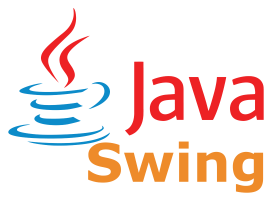

<i>Once upon a time, before ChatGPT, some humans coded for pleasure...</i>

<h1 align="center">CoronaPoker</h1>

  
  

This is the project of a perfectionist, who one day during the confinement of COVID19, came up with the idea of developing the most complete and fun open source game of Texas hold'em for his friends. I hope you enjoy playing it as much as I enjoy programming it. Carpe diem.

<b>(Proudly) developed with:</b> 

<h1 align="center"><a href="https://github.com/tonikelope/coronapoker/releases/latest"><b>DOWNLOAD CORONAPOKER</b></a></h1>

https://github.com/tonikelope/coronapoker/assets/1344008/88ee3491-459f-43e7-8f62-3567c593482d

## Some features:
- Cross platform.
- Secure by design: Zero Trust architecture and a (modest but pain-in-the-ass) Ring-3 anticheat.
- No central servers nor third parties logging things (just you and your friends).
- Point-to-point encryption (DH + AES 128).
- Password protected games.
- Up to 10 simultaneous human/bot players.
- Intuitive interface (with comfortable key shortcuts).
- Global in-game zoom (UHD resolution supported).
- TRUE RANDOM shuffle (<a href="https://github.com/tonikelope/coronapoker/raw/master/shuffle.pdf">MORE INFO</a>).
- Cool sounds, decks, mats, cinematics and 3D card effects.
- ALL-IN side pots fully supported.
- "Dead button" rule for BB/SB/DE positions.
- IWTSTH rule available (can be enabled/disabled by the host during the game).
- RABBIT HUNTING (can be enabled/disabled by the host during the game).
- All blinds stuff adjustable by the host during the game.
- Rebuy available.
- Waiting room chat with emojis, custom gifs and urls support.
- Text to speech fast chat and sending of custom gifs during the game.
- 3 view modes for different screen sizes (normal, compact, and super compact) and low brightness mode.
- Very high tolerance to network/power failures (games can be resumed from exact stop point).
- It is possible to pause the game at any time and add new players.
- Game log and statistics.
- English and spanish language.
- Customizable: create and share your MODs with custom font, decks, sounds and cinematics.

## GET CORONAPOKER

### [OPTION A (Recommended)] DOWNLOAD <a href="https://github.com/tonikelope/coronapoker/releases/latest">LATEST RELEASE</a>

<i>Important: if you plan to distribute CoronaPoker as a package for your favorite Linux distribution and you wish to keep anticheat module enabled you MUST use this option (otherwise the binaries will be different for each player, generating false positives).</i>

### [OPTION B] BUILD CORONAPOKER FROM SOURCE:

<i>Use this option if for any reason you want to compile your own version of CoronaPoker and distribute it to your friends (if you are one of the friends, my security advice is that you all use option A).</i>

# 👁️ PANOPTES ZERO-TRUST ENGINE
**Cryptographic Consensus & Stateless Auditing Protocol for Decentralized P2P Environments**

## 📌 Executive Summary

Panoptes is a natively compiled, multi-platform security and consensus engine designed to enforce absolute mathematical fairness in decentralized Peer-to-Peer (P2P) card games.

In traditional client-server topologies, players implicitly trust a central authoritative server. In a purely decentralized P2P model, one of the players must act as the host. This introduces the **"Malicious Host" vulnerability**: the host has physical access to the RAM where the deck is shuffled and the game state is maintained, allowing them to theoretically peek at hidden cards, alter the deck, or manipulate outcomes.

Panoptes was engineered to eliminate this vulnerability. By replacing implicit trust with rigid cryptographic proofs, the engine ensures that the host is mathematically blind to the game state until the network achieves consensus. Every action is sealed, every state transition requires cryptographic consent, and every finished hand is statelessly audited by all peers.

---

## 🃏 The Cryptographic Game Protocol (Hand Lifecycle)

The core achievement of Panoptes is its state machine. A standard game progresses through distinct phases (Pre-flop, Flop, Turn, River, Showdown). Panoptes protects each phase using a combination of asymmetric cryptography, multi-party entropy, and ephemeral permission tokens.

### Phase 1: Distributed Entropy & The Deal
The game begins by ensuring no single entity—not even the host—can dictate the deck's order.
* **Sourced Entropy:** Every active player client generates a local cryptographic seed and submits it to the host.
* **The Master Shuffle:** The host's native engine combines its own entropy with the collected seeds from all players to generate a unified master key. This key is used to deterministically shuffle the deck. Because the final deck order relies on the combined input of all peers, predicting the shuffle is impossible unless all nodes collude.
* **The Digital Envelopes:** Once shuffled, the engine deals the "pocket cards" to the players. However, these cards are never sent in plaintext. The engine uses asymmetric cryptography to encrypt each player's cards against their specific public key.
* **The Mega-Packet:** The server constructs a single, immutable data payload containing the public keys, the individual encrypted envelopes, and a cryptographic commitment to the remaining deck. This packet is broadcasted to all peers.
* **Note on Spectators:** Clients without chips in the pot are mathematically excluded from the Deal. The engine does not generate envelopes for them, maintaining strict data compartmentalization.

### Phase 2: The Memory Vault & Forward Secrecy
While players decrypt their pocket cards locally, the remaining community cards (the board) reside in the host's RAM. To prevent the host from simply reading these values out of memory, Panoptes uses a secure Vault.
* **State Shielding:** The community cards are encrypted in memory using a high-speed stream cipher. The key to this cipher is ephemeral and volatile.
* **Blind Host:** At this stage, the host application has the encrypted data but mathematically lacks the keys to decrypt the Flop, Turn, or River. The host is just as blind as the clients.

### Phase 3: Token Consensus (Advancing the Game State)
When the betting round concludes and it is time to reveal community cards (e.g., the Flop), the host cannot simply query the engine for the cards.
* **Permission Tokens:** The host requests cryptographic "Tokens" from all active clients.
* **Key Reconstruction:** Each client submits their unique token. The native engine aggregates these tokens. Only when all required tokens from the active players are combined can the engine reconstruct the ephemeral key needed to unlock that specific street in the Vault.
* **Perfect Forward Secrecy:** The moment a street (like the Flop) is decrypted and broadcasted, the underlying ephemeral keys used for that decryption are permanently wiped (zeroed) from the host's RAM. It is mathematically impossible to query the Vault for the same state twice, neutralizing memory replay attacks.

### Phase 4: Showdown & The Stateless Audit
When the hand reaches the end, the system must prove that the host did not manipulate the envelopes, the community cards, or the original shuffle during the hand's progression.
* **Master Key Revelation:** At showdown, players reveal the specific key fragments that were hidden inside their original digital envelopes.
* **Stateless Client Verification:** Once the final Master Key is reconstructed, every client runs a localized, stateless audit. The client inputs the original Mega-Packet from Phase 1, the Master Key, and the final community cards into their own Panoptes engine.
* **The Avalanche Effect:** The engine re-simulates the entire hand mathematically. If the host manipulated a single bit—whether by altering a community card, faking a signature, or injecting a rogue envelope—the cryptographic hash will avalanche, producing a completely invalid signature. The client will instantly detect the manipulation, flag the host as compromised, and sever the connection.

---

## 🛡️ The Panoptes Anti-Cheat Engine

CoronaPoker includes a custom, native anti-cheat layer written in C. It operates at the OS level to ensure the integrity of the JVM and the host environment.

> ⚠️ **SECURITY NOTICE: CLOSED-SOURCE ENGINE** While the CoronaPoker Java client and server routing logic are open-source (GPLv3), the source code for the native `Panoptes` zero-trust and anti-cheat engine remains **strictly closed-source**. This is a deliberate, non-negotiable security measure. Pre-compiled binaries are provided for supported platforms.

