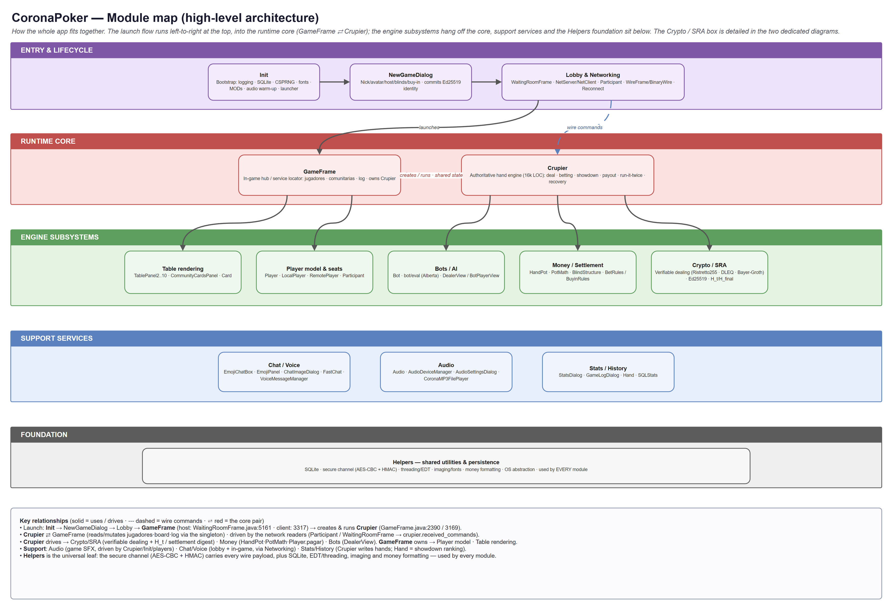

<div align="justify">

<i>Once upon a time, before ChatGPT, some humans coded for pleasure...</i>

<h1 align="center">CoronaPoker</h1>

<p align="center">
  <a href="https://GitHub.com/Naereen/StrapDown.js/graphs/commit-activity"></a>
  <a href="https://www.gnu.org/licenses/gpl-3.0"></a>
</p>

This is the project of a perfectionist who, during the COVID-19 lockdown, decided to build the most complete and enjoyable open-source Texas Hold'em game for his friends. What began as a passion project gradually evolved into something much larger: a long-term software engineering laboratory where every subsystem (from networking and cryptography to artificial intelligence and distributed systems) became an opportunity to build things the way I believed they should be built.

The ambition was never to create the biggest poker game. It was to create the poker game I always wanted to play and the software project I always wanted to engineer.

I hope you enjoy playing it as much as I have enjoyed building it.

**Carpe diem.**


<p align="center"><a href="https://github.com/tonikelope/coronapoker/releases/latest" target="_blank"></a></p>

<h1 align="center"><a href="https://github.com/tonikelope/coronapoker/releases/latest"><b>DOWNLOAD CORONAPOKER</b></a></h1>

<a href="https://youtu.be/WmV8Qg6urKw" target="_blank"></a>


# Features

## 🔐 Security & cryptography

CoronaPoker was built with one non-negotiable principle: **nobody should ever be able to cheat, spy or tamper, not even the host.**

### Zero-trust deck protocol
Every card is shuffled and locked collectively by **every player at the table** through a commutative Mental Poker (SRA) protocol, with a zero-knowledge **verifiable shuffle** that every player re-checks independently, so a malicious host cannot peek, duplicate or relocate a card. Pocket cards stay sealed end-to-end until showdown. Community cards unlock per street. **No single participant, not even the host, can see another player's hole cards or peek at the board before it is legitimately revealed**, and each hand is re-shuffled collectively, so distribution is verifiable and unbiasable. *(Built from scratch over Ristretto255, with DLEQ-chained dealing and a Bayer-Groth shuffle. Full details in the spec linked below.)*

### Per-nick cryptographic identity & signed actions
Every player carries a persistent **Ed25519 keypair** stored locally with restricted ACLs (POSIX 0600 / Windows ICACLS-locked). Every betting action, every community-card reveal and every showdown reveal is signed under a domain-separated context. A **hash chain** ratchets over each hand (`H_{t+1} = SHA-256(record || sig)`), committing every peer to the exact action history, and its closing state folds in the hand's **settlement** (who put in how much and who was paid how much), committing the pot payout alongside the actions. After the hand, peers exchange short **receipts** (`HAND_ID || H_final || flags || sig`). A divergent receipt (peers disagreeing on the actions, the board or the money) surfaces as a logged dispute. A first-contact identicon dialog lets two players verify each other's pubkey out-of-band (TOFU).

### End-to-end encrypted channels
All traffic between players is encrypted with **AES-256-CBC + HMAC-SHA256** over keys negotiated via **ECDH key exchange**. Anyone on the network path sees only opaque blocks. Game state, chat messages and player actions are unreadable. The recovery payload reader installs a strict **`ObjectInputFilter` whitelist** (HashMap / String / numeric boxes only, 10 MB cap, 20-deep) so a malicious host cannot exploit Java deserialization gadgets.

### Password-bound keys
In password-protected games the symmetric channel keys are derived from the password with **HMAC-SHA512** over the raw ECDH shared secret. A passive MITM cannot complete the handshake without the password.

### Atomic security lockdown
Any cryptographic anomaly (an off-curve point, a bad Ed25519 signature, a mismatched community reveal, an early-cascade attack) flips an atomic lockdown flag that immediately aborts the hand and refuses further commands from the offending peer, logged with a precise reason.

### Fully decentralised
Pure P2P, no central servers, no accounts and no third party logs. Your game exists only between the machines at the table.

> Full cryptographic spec (cascade flow, key schedule, HandStateChain seed, receipt format, recovery fossil layout) lives in **[`docs/SECURITY.md`](docs/SECURITY.md)**.

---

## 🌐 Networking & resilience

- **Automatic UPnP port mapping**: when you host a game, CoronaPoker tries to open the listening port on your router and cleans it up when the table closes. Manual port forwarding works as a fallback.
- **Adjustable listening port**: defaults to 7234, configurable per game.
- **Optional password protection** for the table itself, on top of channel encryption.
- **Smart reconnection**: if a player drops, a 45-second base grace window holds their seat. Once the peer's reauthenticated reconnect intent reaches the host, the window extends to 80 seconds so a flaky link gets a real second chance before the table asks whether to remove them.
- **Crash recovery**: every hand is checkpointed to a local **SQLite** database (per-action history, balances, dealer/SB/BB, crypto fossil with the full cascaded deck and the keys you'd need to re-derive your hole cards), so a game can resume from the exact stop point after a crash, power loss or reboot, for both host and clients.
- **Late-joiner observer mode**: a player invited mid-recovery watches the in-progress hand as a passive spectator (no cards dealt, no actions requested) and joins normally on the next hand.
- **Recent-server list**: persisted history of past tables. Browse it with the up and down arrow keys in the Join dialog to reconnect to anyone you've played with before.
- **Per-peer link telemetry**: host tracks round-trip latency and reconnection count per seat and broadcasts it so flaky links surface early.
- **Anti-flood chat**: 0.5-second minimum between chat messages (client-side throttle on the sender's input).

---

## 🃏 Texas Hold'em: rules & table

A rules-correct No-Limit Hold'em implementation, focused on private home games rather than tournament structures.

| Feature | Details |
|---|---|
| **Players** | 2 to 10, any mix of humans and bots |
| **ALL-IN & side pots** | Fully supported with correct pot splits |
| **Dead-button rule** | BB / SB / Button handled correctly when players leave |
| **Action timer** | Per-turn thinking time with on-screen countdown bar |
| **Buy-in** | Fixed (everyone starts with the same stack) or variable, where each player chooses their own when they sit down. The host sets the allowed range in big blinds and a per-table stack ceiling nobody can ever exceed. |
| **Rebuy** | Mid-game top-up scheduled for the next hand, host-toggleable. Optional per-player rebuy limit, a stack-ceiling policy (capped at the table buy-in or at the current biggest stack) and a separate toggle for whether bots rebuy. |
| **Blinds** | Adjustable by the host live, either a manual change or scheduled escalation, with optional custom blind structures (your own saved ladders of small/big blind levels, big blind free of the 2x default) and an optional cap that stops them climbing past a chosen big blind. Money resolves to the cent and blinds move in 0.05 steps, with exact accounting even on deep-stack tables. |
| **Ante & Straddle** | Two optional extra bets, off by default and host-toggleable. **Ante**: every active player posts a small dead-money ante (equal to the small blind) into the pot before the blinds. **Straddle** is **voluntary**: right after the deal, with their cards still face down and a 10-second timer (declined by default), the under-the-gun player is asked whether to post a live 2x big blind. If they post it, it buys the option to act last preflop (the "gun" moves on to the real first-to-act). If they decline, their hand simply begins as a normal turn. Both flash chips into the pot like any bet and are flagged on the felt and in the game log. |
| **Saved game presets** | Save an entire new-table setup (initial blinds and the chosen structure, buy-in, rebuy, blind increase/cap, hand limit, ante, straddle and bot difficulty) as a named profile and reload it in one click, just like custom blind ladders. A "Default" entry restores the factory setup. |
| **Pause & join** | Pause anytime. New players can be added to a running session |
| **IWTSTH** | "I Want To See That Hand"  |
| **Rabbit Hunting** | Reveal what would have come on the remaining streets, toggleable |
| **Run It Twice** | On a multi-way all-in, the involved players vote to deal the remaining board twice and split each (side)pot between the two run-outs. Unanimous (a single NORMAL vote, or a vote timeout, cancels it), host-toggleable. |
| **Spectator mode** | Busted-out players can stay at the table and watch the rest of the session |
| **Hand generator** | Beginner-friendly tool: shows random example deals for each hand category (from high card up to royal flush) so newcomers learn how rankings form, browsed with up/down keys |

### 📜 Robert's Rules of Poker compliance

CoronaPoker follows **Robert's Rules of Poker**, the de-facto standard cardroom rulebook, for every rule a digital game can meaningfully enforce. The betting engine cites the specific rules right in its source (`BetRules.java`). The table below maps the implementation to the rulebook's *play* rules. (A lot of the casino-floor rules only make sense in a brick-and-mortar room and simply don't apply to a peer-to-peer digital table: rake and collection, cash on the table, physically protecting your hand, verbal-in-turn etiquette, foreign-language and waiting-list policy. On top of that, the verifiable-deck protocol already makes most of the frauds they exist to prevent impossible by construction.)

| Rule | Robert's Rules | CoronaPoker |
|---|---|---|
| **Hole cards & deal order** | §5: two hole cards, dealt one at a time starting left of the button, and the button gets the last one | ✅ |
| **Burn cards & board** | §5: burn before flop, turn and river, then a flop of 3, turn 1 and river 1. Playing the board is allowed | ✅ |
| **Button rotation** | §4: moves one seat clockwise after each hand | ✅ |
| **Dead button** | §4.2(b): BB, SB and button adjust correctly when a player leaves | ✅ |
| **Blind positions** | §4: SB first clockwise from the button, BB second. Preflop opens UTG, postflop opens the SB | ✅ |
| **Heads-up** | §4.3: the SB is *on* the button, acts first preflop and last postflop | ✅ |
| **No-Limit raising** | §14.1-3: unlimited raises, minimum bet equals the big blind, and a raise must be at least the previous bet or raise | ✅ |
| **Incomplete all-in** | §14.3: an all-in for less than a full raise does **not** reopen the betting to players who already acted | ✅ |
| **Aggregated short all-ins** | §14.4: several short all-ins that together add up to a full raise **do** reopen the betting | ✅ |
| **Straddle** | §14.15: one optional live straddle, 2x BB, immediately left of the BB, sets a new bring-in | ✅ |
| **Hand ranking & cards speak** | §3: best five of seven, kicker tie-breaks, hands read for themselves | ✅ |
| **Ties & suits** | §3 (Ties): suits never break a tie for a pot | ✅ |
| **Side pots** | §3 (Showdown 7): each player only contests the portion of the pot they contributed to | ✅ |
| **Showdown order** | §3 (Showdown 8): last aggressor shows first, and if it was checked down, first-to-act shows first | ✅ |
| **Muck losing hands** | §3 (Showdown): a beaten hand may be thrown away without showing (the *IWTSTH* toggle) | ✅ |
| **Run it twice** | §14.17: all-in players may agree to deal the board twice | ✅ |
| **Action clock** | §14.16: a time limit may be set, and on time-out the hand is dead | ⚠️ *house tweak* |
| **Odd chip** | §3 (Ties, 5a): an indivisible odd chip goes to the first player clockwise from the button | ⚠️ *house rule* |

**House-rule choices (deliberate deviations)**

- **Odd chip.** Instead of handing the indivisible cent to whoever sits next to the button, CoronaPoker carries it into a **shared carry-over pot that rolls into the next hand**. Money stays exact to the cent and no seat position ever gains from a split. I find that fairer, and it's something Robert's Rules itself sanctions under §2 (House Policies, rule 1: *"Management reserves the right to make decisions in the spirit of fairness"*). The same carry-over pot also absorbs the leftover cent from a Run It Twice board split, which the rulebook doesn't address, so it all stays a single, uniform mechanism.
- **Action timeout.** Where the rulebook always kills the hand on time-out, CoronaPoker **auto-checks when checking is free** and only auto-folds when there's a bet to call (the online-poker standard). The clock itself is fully configurable, and you can switch it off entirely.

> 📄 The full rulebook ships with the game. Read it here: **[Robert's Rules of Poker (PDF)](robert_rules.pdf)**.

---

## 🤖 Bots

These aren't the fold-everything-and-wait kind. CoronaPoker bots play like real opponents.

- **3 difficulty levels** (Easy, Medium, Hard), each clearly distinguishable within a single session
- **3 skill tiers** assigned per bot, weighted by difficulty:
  - 🍿 **Recreational**: loose, emotional, prone to tilt after losses
  - 🛠️ **Regular**: solid fundamentals, occasional mistakes
  - 🦈 **Shark**: disciplined, exploitative, calculates fold equity
- **4 adaptive personalities** that shift dynamically with stack pressure (M-ratio), tilt and table dynamics:
  - 🗿 **NIT**: tight, conservative, rarely bluffs
  - 📡 **STATION**: calls everything, impossible to read
  - 🎯 **TAG**: tight-aggressive, the textbook grinder
  - 💥 **LAG**: loose-aggressive, unpredictable and relentless
- **Real poker engine** built on the Alberta hand evaluator + hand-potential (true equity, not lookup tables)
- Multi-street planning: **c-bets, polarised river & turn bluffs, semi-bluffs, slow-played traps, float plays, scare-card reads, MDF bluff-catching** and range-aware aggression, so they don't play their hand face-up
- **Per-bot opponent tracking** (VPIP / PFR / AF, calling-station & maniac reads): they remember your tendencies and *stop bluffing the player who never folds*
- **Heads-up vs multi-way awareness**: ranges and bluff frequencies are gated to the table size
- **Calibrated mistake injection** scaled by difficulty: Hard is razor-sharp, Easy makes human-shaped errors in the right spots
- **Validated through AAA QA**: every release is benchmarked against fixed-strategy opponents over tens of thousands of hands before shipping

> Full bot AI write-up, covering architecture, the hand-evaluation maths, the personality model and the per-turn decision pipeline (with two diagrams), lives in **[`docs/BOTS.md`](docs/BOTS.md)**.

---

## 💬 Chat, voice & social

### Waiting room chat
Full chat while the game is being set up, with a built-in **emoji picker (~1.800 emojis with recent-use history)**, inline **GIF support** with automatic format conversion (bundled `gifsicle` binary for Windows / Linux / macOS) and **automatic image previews** for URLs pasted into the chat.

### In-game fast chat
A side panel for sending quick messages mid-hand without leaving the action, with **text-to-speech readout** of incoming messages and inline GIFs.

### 🎙️ Voice messages
Walkie-talkie style, push-to-record: **hold a key (F9 by default, rebindable), speak, release to send**. The on-screen recording banner only appears once the microphone is actually capturing (when you see it, nothing you say can be lost), with a draining countdown bar (15 seconds max, auto-send at the cap). While you record, **all local game audio is silenced** so your mic picks up your voice and nothing else. The note travels to every player through the same end-to-end encrypted channel as the chat and plays automatically on arrival (music ducks under the voice, the speaker's avatar lights up), including on your own machine as send confirmation. Every note also lands in the chat history as a clickable **[Voice message]** entry. Click it (or its emoji) to replay anytime. The line turns into *[Playing...]* while it sounds, and clicking another note switches to it. Notes are kept locally under `.coronapoker/voice/` as standard WAV files. The whole feature is **host-toggleable per game** (the rule survives stop & recover) and respects per-player muting.

### 🔊 Audio settings
Right-click any speaker icon for the audio settings dialog: **master volume** (two-way synced with the global Shift + Up/Down shortcut, persisted across sessions), **output device** selection with instant hot-switching (background music jumps to the new device immediately), and **microphone** enablement, device selection and push-to-record key binding for voice messages.

### Player avatars
Each player picks a local **avatar image** (or falls back to a built-in default) that the host distributes to the rest of the table at join time. Bots use a dedicated bot avatar. Avatars are decorative, not authoritative. Identity binding lives in the Ed25519 keypair (see the Security section), and a separate **identicon dialog** lets you compare deterministic mosaics out-of-band: at the table, click a player's avatar for their **Ed25519 pubkey** identicon (with a TOFU "mark verified" button to remember future connections). In the waiting room, right-click your own nick for the **session-key (AES channel)** identicon used to detect a network MITM.

### Action sounds & character voices
Distinct sounds for every action (deal, check, call, raise, fold, all-in, showdown, winner) plus comedy voice clips that can be triggered on common actions. Everything is toggleable and replaceable.

---

## 📊 Statistics & history

- **Local SQLite database** stores every hand played: timestamps, actions per street, board, stacks, winner and pot.
- **Per-session and per-hand stats viewer**: browse past games, replay any single hand and inspect aggregated metrics per player.
- **Live in-game log**: real-time scrolling action log for the current hand.
- **No cloud, no accounts**: there is no server upload and no online account. Your database is just a local file.
- **Peer-to-peer stats sync**: optionally, the players at a table converge their finished games directly with one another (no server in the middle), so everyone builds up the same shared history over time. Receiving and sharing are independent toggles, both on by default.
- **Private games and share exclusions**: mark a game private to keep it out of what you share, and open the "Exclude" dialog to leave out private games (excluded by default) or every game that one or more nicks from a comma-separated list took part in.

---

## 🎨 Customization & MOD packs

Every visual and audio asset is replaceable through redistributable MOD packs:

- **Card decks**: 4 themes bundled (`coronapoker`, `interstate60`, `goliat`, `goliat4`), each in both animated GIF and static HQ variants.
- **All-in cinematics**: 9 bundled movie clips that play on every all-in. MOD packs can replace the whole set.
- **Sound packs**: full per-language sound trees (English / Spanish) for actions, showdowns, voices and ambient music.
- **Fonts**: custom display fonts (e.g. McLaren bundled by default).
- **Background music**: context-aware tracks for waiting room, gameplay and stats screen.
- **One-file distribution**: drop a single MOD pack in the right folder and it is picked up on next launch.

---

## 🖥️ UX & display

- **Four table layouts** (Normal, Compact, Super-Compact and Ultra-Compact) to fit anything from a 13" laptop to a 4K monitor.
- **Global zoom** with keyboard shortcuts and an optional auto-zoom that fits the table to the window.
- **Low-brightness overlay** for late-night sessions.
- **Cool animations** (optional).
- **Action confirmation**: optional safety prompt before fold / all-in / raise.
- **Auto-action buttons**: pre-arm your next move while it's not your turn: check/fold (never mucks a free check) or auto-call up to a configurable limit. Optionally keep the pre-press armed across hands, and veto each automatic action through a 5-second cancelable **AUTO MODE** dialog.
- **Keyboard shortcuts** for every common action with a built-in reference dialog.

---

## 🌍 Internationalization

- Bundled languages: **English** and **Spanish**.
- All UI strings, dialogs, action labels and contextual sounds are localised, including the comedy voice packs.

---

## 🧱 Stack

- **Java** (builds on JDK 11+, but needs **JDK 15+ to run** for the built-in Ed25519 provider, with current development on JDK 25)
- **Swing** UI with NetBeans Matisse forms
- **Maven** build, single self-contained shaded jar
- **Alberta** poker hand evaluator for true equity computation
- **SQLite** (via `sqlite-jdbc`) for local hand history
- Pure-Java **SRA / Ristretto255** implementation (RFC 9496) with DLEQ-proof verifiable dealing and a zero-knowledge **Bayer-Groth verifiable shuffle**, no native crypto dependencies

---

## 🏗️ Architecture

A high-level map of how the whole app fits together, covering the launch flow, the runtime core (`GameFrame` talking to `Crupier`), the engine subsystems that hang off it, and the shared `Helpers` foundation:



The cryptographic subsystem, covering verifiable **SRA / Ristretto255** dealing with DLEQ proofs, the zero-knowledge **Bayer-Groth** shuffle, per-nick **Ed25519** identity, the per-hand `H_t` ratchet and the receipt consensus, has its own two diagrams (a component architecture and a full per-hand protocol sequence) embedded in **[`docs/SECURITY.md`](docs/SECURITY.md)**.

The **bot AI**, covering its architecture, hand-evaluation maths, personality model and per-turn decision pipeline, is documented in depth, with its own two diagrams (a component architecture and a decision-flow chart), in **[`docs/BOTS.md`](docs/BOTS.md)**.

---

## Build from source

Requirements: JDK 11+ to build, JDK 15+ to run (the built-in Ed25519 signature provider arrived in JDK 15), Apache Maven 3.x.

```bash
git clone https://github.com/tonikelope/coronapoker.git
cd coronapoker
mvn clean package
```

The runnable jar is generated at `target/CoronaPoker-<version>-jar-with-dependencies.jar`. Launch it with:

```bash
java -jar target/CoronaPoker-<version>-jar-with-dependencies.jar
```

---

## 🙌 Contributors

CoronaPoker is developed by [@tonikelope](https://github.com/tonikelope), with a heartfelt thank-you to the bug reporters and testers whose detailed reports keep the project moving forward. The full list lives in **[`CONTRIBUTORS.md`](CONTRIBUTORS.md)**.
