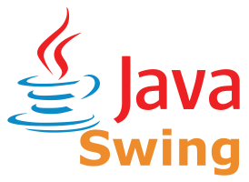

<i>Once upon a time, before ChatGPT, some humans coded for pleasure...</i>

<h1>CoronaPoker</h1>

 

This is the project of a perfectionist, who one day during the confinement of COVID19, came up with the idea of developing the most complete and fun open source game of Texas hold'em for his friends. I hope you enjoy playing it as much as I enjoy programming it. Carpe diem.

<b>(Proudly) developed with:</b> 

<h1 align="center"><a href="https://github.com/tonikelope/coronapoker/releases/latest"><b>DOWNLOAD CORONAPOKER</b></a></h1>

https://github.com/tonikelope/coronapoker/assets/1344008/88ee3491-459f-43e7-8f62-3567c593482d

## Some features:
- Cross platform.
- Secure by design with a (modest) Ring3 anticheat + Zero Trust Crypto Architecture.
- No central servers nor third parties logging things (just you and your friends).
- Point-to-point encryption (DH + AES 128).
- Password protected games.
- Up to 10 simultaneous human/bot players.
- Intuitive interface (with comfortable key shortcuts).
- Global in-game zoom (UHD resolution supported).
- TRUE RANDOM shuffle (<a href="https://github.com/tonikelope/coronapoker/raw/master/shuffle.pdf">MORE INFO</a>).
- Cool sounds, decks, mats, cinematics and 3D card effects.
- ALL-IN side pots fully supported.
- "Dead button" rule for BB/SB/DE positions.
- IWTSTH rule available (can be enabled/disabled by the host during the game).
- RABBIT HUNTING (can be enabled/disabled by the host during the game).
- All blinds stuff adjustable by the host during the game.
- Rebuy available.
- Waiting room chat with emojis, custom gifs and urls support.
- Text to speech fast chat and sending of custom gifs during the game.
- 3 view modes for different screen sizes (normal, compact, and super compact) and low brightness mode.
- Very high tolerance to network/power failures (games can be resumed from exact stop point).
- It is possible to pause the game at any time and add new players.
- Game log and statistics.
- English and spanish language.
- Customizable: create and share your MODs with custom font, decks, sounds and cinematics.

## GET CORONAPOKER

### [OPTION A (Recommended)] DOWNLOAD <a href="https://github.com/tonikelope/coronapoker/releases/latest">LATEST RELEASE</a>

<i>Important: if you plan to distribute CoronaPoker as a package for your favorite Linux distribution and you wish to keep anticheat module enabled you MUST use this option (otherwise the binaries will be different for each player, generating false positives).</i>

### [OPTION B] BUILD CORONAPOKER FROM SOURCE:

<i>Use this option if for any reason you want to compile your own version of CoronaPoker and distribute it to your friends (if you are one of the friends, my security advice is that you all use option A).</i>

# CoronaPoker: Zero-Trust Cryptographic Poker Engine

CoronaPoker is a secure peer-to-peer oriented Texas Hold'em engine built on a strict **Zero-Trust Architecture**. 

In traditional online poker, players must blindly trust the central server. If the server is compromised, or if the administrator is malicious (as seen in historical online poker super-user scandals), the integrity of the entire game is destroyed. CoronaPoker solves this by implementing a hybrid Mental Poker cryptographic protocol combined with a native, ring0-aware anti-cheat engine.

**The core philosophy: The server routes the game, but it cannot cheat.**

---

## 🛡️ Architecture Overview: The Zero-Trust Paradigm

CoronaPoker separates game routing from cryptographic visibility. Even if the host server is fully compromised, the attacker cannot read the hole cards of other players or manipulate the deck order without triggering immediate cryptographic alarms on the clients.

### 1. Cryptographic Dealing & Mental Poker
Instead of the server generating a deck and sending plaintext cards to clients, CoronaPoker uses a multi-layered cryptographic approach (KEM - Key Encapsulation Mechanism):
* **Ephemeral Key Pairs:** For every single hand, new ephemeral keys are generated. 
* **Blind Envelopes:** The native C-engine (`Panoptes`) generates the deck and encrypts each player's hole cards using their respective Public Keys. The server only sees encrypted "envelopes" (byte chunks).
* **Decentralized Decryption:** Only the specific client possesses the corresponding Private Key to open their envelope. The server physically cannot know what cards were dealt to the players.

### 2. The Custodian Protocol (Secure State Resumption)
If the server crashes or the game is paused, the state must be saved to disk. However, allowing the server to encrypt and decrypt the game state alone would violate Zero-Trust.
* **Distributed Lockboxes:** When the game state is fossilized, the Master Key is encrypted multiple times, creating a "Lockbox" for each *human* player (using their persistent Identity Keys).
* **Server Impotence:** The server does *not* possess a lockbox for its own private key. It cannot decrypt the paused game state on its own.
* **Democratic Recovery:** To resume a game, the server must contact an active remote player (a Custodian), send them their specific encrypted Lockbox, and request them to unlock the Master Key. If a legitimate player does not authorize the resumption, the game remains cryptographically locked.

### 3. Anti-Replay Mechanisms
To prevent a malicious server from intentionally dealing a previously recorded hand (where the server knows the outcome), CoronaPoker implements strict Anti-Replay validation.
* Each decrypted envelope yields a unique, cryptographic `handId`.
* Clients independently verify this ID against a local ledger. If the server attempts to serve a historical payload, the client rejects the hand, alerts the player of a "Cheating Server," and forces a fold.

---

## 👁️ The Panoptes Anti-Cheat Engine

CoronaPoker includes a custom, native anti-cheat layer written in C (`libpanoptes`), integrated via JNI. It operates at the OS level to ensure the integrity of the JVM and the host environment.

> ⚠️ **SECURITY NOTICE: CLOSED-SOURCE ENGINE**
> While the CoronaPoker Java client and server routing logic are open-source (GPLv3), the source code for the native `Panoptes` anti-cheat engine remains **strictly closed-source**. This is a deliberate, non-negotiable security measure. Releasing the source code of the memory monitoring algorithms, process validation checks, and obfuscation parameters would provide malicious actors with the exact blueprint needed to bypass the anti-cheat mechanisms. Pre-compiled, heavily obfuscated binaries are provided for supported platforms.

### Cryptographic Heartbeats (SECPING / SECPONG)
Standard TCP pings are easily spoofed. CoronaPoker utilizes a signed heartbeat protocol to ensure the client endpoint has not been hijacked or replaced by a bot:
1.  The server generates a cryptographic challenge bound to the specific TCP session (IP:Port).
2.  The native Panoptes engine on the client side must sign this challenge using its loaded Identity Key.
3.  Failure to provide a mathematically valid, timely signature results in the player being flagged as an unsecure/compromised endpoint.

### Process & Memory Integrity (Native Checks)
The native library actively monitors the OS environment to detect tampering, debugging, or memory injection:
* **Debugger Detection:** Actively parses process status (`/proc/self/status` on Linux, equivalent APIs on Windows/macOS) to detect attached debuggers (`TracerPid`).
* **Socket Validation:** Scans host file descriptors and network tables (`/proc/net/tcp`) to ensure the Java sockets map legitimately to the Panoptes native instance, preventing Man-In-The-Middle (MitM) proxies running on `localhost`.
* **Obfuscation:** The native C code is heavily obfuscated (using advanced tooling like Tigress) with control-flow flattening and virtualization, making reverse-engineering the signing algorithms and memory offsets extremely difficult for attackers.

---

## 🏗️ Technical Stack & Compilation

* **Logic & UI:** Java (Swing) with highly asynchronous, non-blocking socket readers and concurrent UI rendering.
* **Cryptography & Anti-Cheat:** C (Native).
* **Cross-Platform Builds:**
    * **Windows:** Compiled via MinGW/MSVC.
    * **Linux:** Compiled inside Dockerized legacy environments (e.g., Ubuntu 18.04/20.04) against older `glibc` versions to guarantee maximum backward compatibility.
    * **macOS:** Cross-compiled using `osxcross`.

---

## 🔒 Threat Model

**What is protected:**
* Server administrator trying to view player hole cards.
* Server trying to replay old hands.
* Attackers attempting to extract private keys from RAM via standard debuggers (GDB/Cheat Engine).
* Network MitM attacks (even on the local machine) via proxy tools.
* Unauthorized game resumption without player consensus.

**What is out of scope (for now):**
* *Screen scraping:* If a player installs malware that literally records their monitor, Panoptes cannot prevent the attacker from seeing the cards visually.
* *Collusion:* Players communicating out-of-band (e.g., via Discord) to share their hole cards with each other.

---
