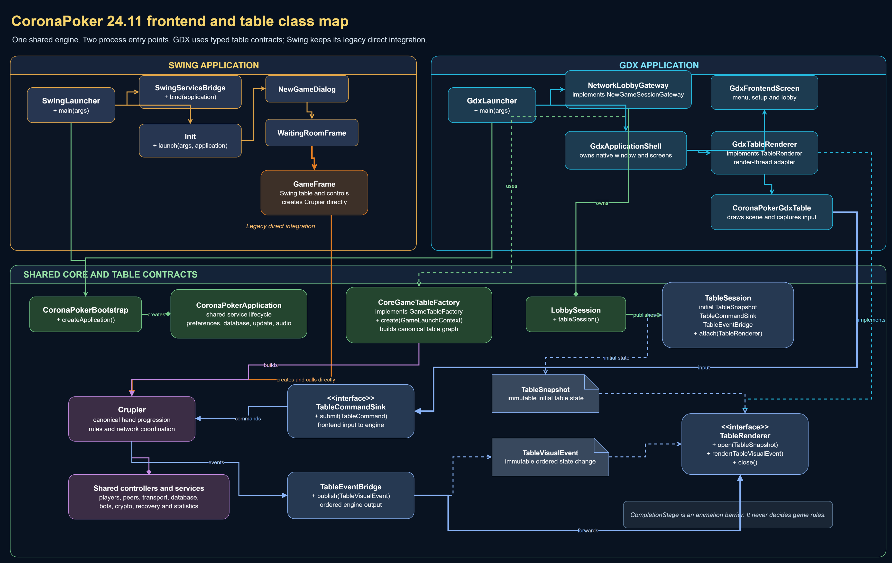

# CoronaPoker architecture

CoronaPoker 24.11 builds two desktop applications from one repository. The
applications share the game engine, network protocol, persistence, security,
configuration and assets. They do not share UI widgets or rendering code.

The architecture is deliberately asymmetric because the Swing application is
the original implementation and the GDX application is the new frontend. GDX
uses a renderer-neutral table boundary. Swing still uses the historical direct
integration between its windows and the shared game classes.



The editable source is
[`coronapoker-frontend-uml.drawio`](diagrams/coronapoker-frontend-uml.drawio).

## Process entry points

### Swing application

The executable entry class is
`com.tonikelope.coronapoker.swing.SwingLauncher`.

Its startup path is:

```text
SwingLauncher.main
  -> CoronaPokerBootstrap.createApplication
  -> SwingServiceBridge.bind
  -> Init.launch
  -> NewGameDialog
  -> WaitingRoomFrame
  -> GameFrame
  -> Crupier
```

`CoronaPokerBootstrap` creates the shared process services. The
`SwingServiceBridge` installs Swing implementations for runtime and audio
services. `Init` then starts the established Swing window flow.

`GameFrame` owns Swing controls and creates the shared `Crupier` engine for the
table. Existing Swing components can still read and call shared game objects
directly. This is the legacy coupling shown in orange in the UML. It is kept so
the original application remains behaviorally stable.

### GDX application

The executable entry class is
`com.tonikelope.coronapoker.gdx.GdxLauncher`.

Its startup path is:

```text
GdxLauncher.main
  -> CoronaPokerBootstrap.createApplication
  -> NetworkLobbyGateway
  -> CoreGameTableFactory
  -> GdxApplicationShell
  -> GdxFrontendScreen
```

`GdxApplicationShell` owns the single libGDX window. `GdxFrontendScreen`
renders the main menu, setup screens and waiting room. The
`NetworkLobbyGateway` owns the real host or client lobby and publishes a
`TableSession` when the network agrees that the game can start.

The table startup path is:

```text
NetworkLobbyGateway
  -> CoreGameTableFactory.create
  -> TableSession
  -> GdxApplicationShell.attachTable
  -> GdxTableRenderer
  -> CoronaPokerGdxTable
```

`CoreGameTableFactory` constructs the canonical shared table graph: `Crupier`,
player controllers, network peers, transport, database adapters and the
renderer-neutral event bridge. GDX does not contain a second poker engine.

## The table contracts

The table contracts live under
`modules/coronapoker-core/src/main/java/com/tonikelope/coronapoker/table`.
They contain data and interfaces, never Swing or libGDX types.

### TableSession

`TableSession` is the ownership handoff between the lobby and a running table.
It contains:

- the authoritative initial `TableSnapshot`;
- a `TableCommandSink` for input from the frontend;
- a `TableEventBridge` for output from the engine;
- a starter that begins the dealer only after the renderer is ready;
- the resources that must be closed when the table ends.

Calling `TableSession.attach(renderer)` performs this order:

1. Attach exactly one renderer.
2. Open it with the initial snapshot.
3. Wait until the frontend reports that the table scene is ready.
4. Start the shared engine.

This order prevents the first game event from arriving before the GDX scene
exists.

### Input: TableCommandSink

GDX controls do not call `Crupier` or player controllers directly. They submit
a typed `TableCommand` through `TableCommandSink`.

```text
CoronaPokerGdxTable
  -> TableCommandSink.submit(TableCommand)
  -> CoreGameTableFactory command adapter
  -> Crupier and shared controllers
```

The command is a request. The shared engine remains authoritative and decides
whether the action is valid.

### Output: TableEventBridge and TableRenderer

The shared engine publishes immutable `TableVisualEvent` values through
`TableEventBridge`. The bridge forwards them to the attached `TableRenderer`.

```text
Crupier
  -> TableEventBridge.publish(TableVisualEvent)
  -> GdxTableRenderer.render
  -> CoronaPokerGdxTable.acceptEvent
```

`GdxTableRenderer` is the adapter between neutral core events and the libGDX
render thread. It posts work to that thread and never decides game rules.

Some events return a `CompletionStage<Void>`. This is an animation barrier,
not a game decision. The engine waits only at established visual boundaries,
for example until dealing or payout animation has reached the required point.

### Snapshots and events

`TableSnapshot` is the complete state required to open a table. Later changes
arrive as ordered `TableVisualEvent` values. This gives GDX a deterministic
initial state followed by an event stream instead of access to Swing widgets
or mutable UI objects.

### Runtime cost

The contract boundary is not a frame-by-frame state copy. One `TableSnapshot`
opens the scene. After that, the core publishes small typed events only when
game state changes. GDX performs its own animation and drawing on every render
frame without asking the core for another snapshot.

Commands follow the same rule: a click submits a small typed request and the
engine publishes the authoritative result. Animation barriers exist only at
the few points where hand progression must wait for presentation. Poker event
frequency is low, so allocation and dispatch cost at this boundary is small
compared with texture rendering, media decoding, network traffic and database
work.

## Source ownership

| Area | Physical owner | Main responsibility |
| --- | --- | --- |
| Shared engine and services | `modules/coronapoker-core` | Rules, dealer, players, network, persistence, security and neutral contracts |
| Swing frontend | `modules/coronapoker-swing` | Original menus, waiting room, table widgets and Swing integration |
| GDX frontend | `modules/coronapoker-gdx` | Native window, screens, table rendering, input and visual effects |
| Shared resources | `src/main/resources`, packaged by `modules/coronapoker-assets` | Images, cards, sounds, translations and bundled media |
| Architecture tests | `modules/coronapoker-qa` | Dependency and source ownership rules |
| Functional certification | `tools/qa` and frontend scenario tests | Shared engine, Swing compatibility and GDX flows |

There is one source owner for each product class. Build output under `target`
is generated and is not another source tree.

## What is shared and what is not

Shared:

- poker rules and hand progression;
- networking and recovery;
- database access and statistics data;
- cryptographic dealing and verification;
- bots and hand evaluation;
- configuration services and assets;
- table state contracts used by GDX.

Frontend-specific:

- Swing components, dialogs and EDT behavior;
- libGDX screens, actors, textures, effects and render-thread behavior;
- layout, animation and visual styling.

The practical rule is simple: a poker decision belongs in core. A visual
decision belongs in the selected frontend. GDX may render an event differently
from Swing, but it must not invent the event or alter its game result.

The GDX Maven module depends on `coronapoker-core` and
`coronapoker-assets`; it does not depend on `coronapoker-swing`. The core has no
Swing UI imports. GDX uses a small number of Java Desktop APIs for operating
system integration such as the native file chooser, clipboard, image and GIF
decoding, keyboard constants and JVM splash handling. Those APIs do not load
or reuse Swing screens, dialogs or table widgets.

## Current migration boundary

The GDX table is fully driven by the shared engine through typed contracts. The
Swing table remains the behavioral reference and still has direct integration
with shared engine objects. Converting Swing to the same contract path would be
a separate refactor with regression risk; it is not required for the two 24.11
applications to use one canonical game engine.
