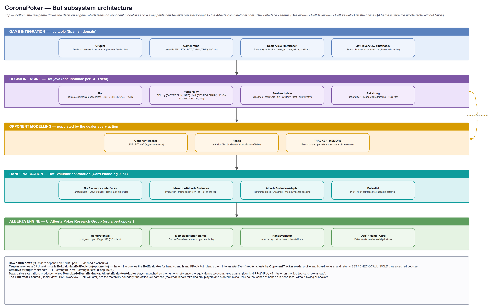
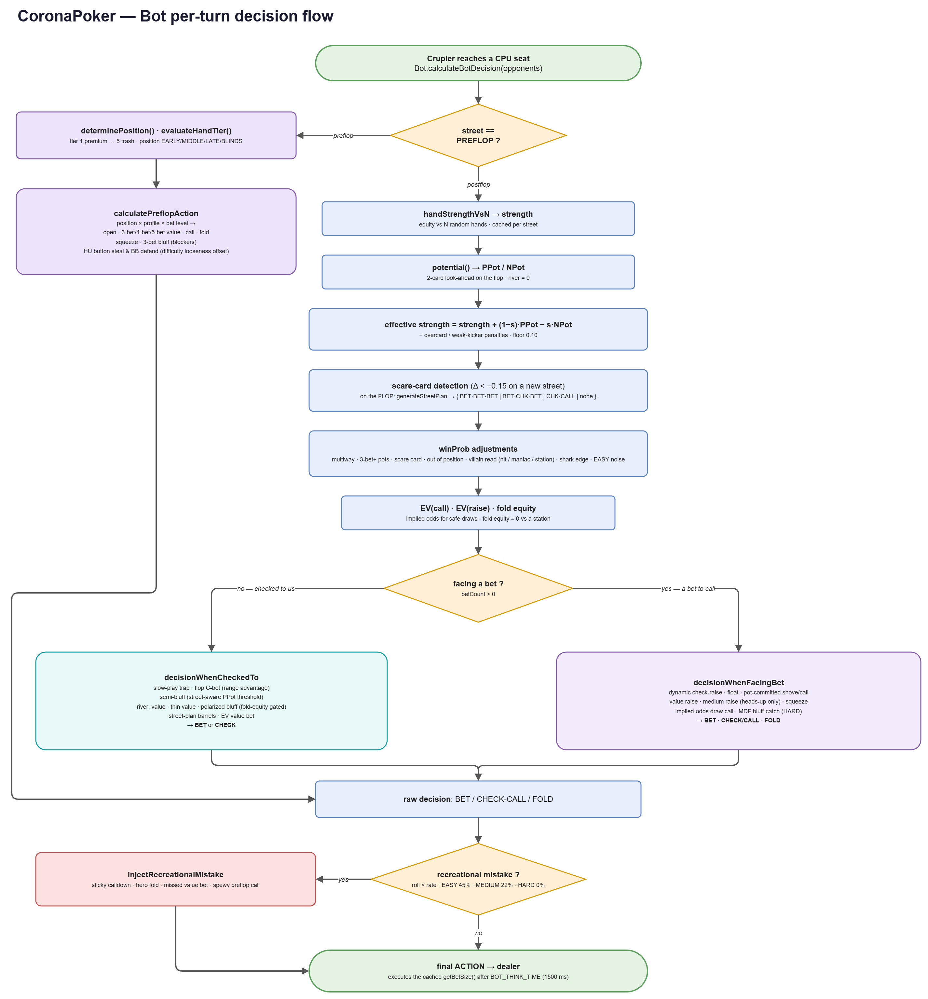

<div align="justify">

# CoronaPoker: Bot AI

This document describes how the CoronaPoker CPU players ("bots") think: their
architecture, the hand-evaluation maths, the personality model, the per-turn
decision pipeline and how the three difficulty levels are kept genuinely
distinguishable. It is the bot counterpart of [`SECURITY.md`](SECURITY.md).

The implementation lives almost entirely in
[`Bot.java`](../src/main/java/com/tonikelope/coronapoker/Bot.java) plus the
`bot/eval` and `bot/context` packages. The underlying combinatorics come from the
University of Alberta Poker Research Group library under `org.alberta.poker`.

---

## 1. Design philosophy

The bot is a **hand-crafted heuristic**, not a solver. It does not run CFR and it
does not compute equity against per-opponent ranges. The chosen ceiling is an
*elite heuristic* whose primary axis is **feeling human** (unpredictable,
capable of a credible bluff, and hard to read or exploit) rather than raw
GTO strength. A home game against friends wants opponents that are fun and
believable across a clear skill ladder, not a perfect machine.

Three properties follow from that:

- **Personality.** Every bot is rolled a *skill* and a *style* so a table feels
  like a mix of nits, calling stations and aggressive regulars rather than nine
  copies of one strategy.
- **A real difficulty gradient.** EASY < MEDIUM < HARD is guaranteed *by
  construction* (see §8), not by hand-waving. The weaker levels commit
  recognisable poker mistakes at increasing frequencies.
- **Measurable calibration.** Every behavioural change is validated in an offline
  simulation harness (`tools/qa`) over thousands of hands. The rule is *measure
  before you touch*. Bot "improvements" judged by eye have repeatedly turned out
  to be regressions.

---

## 2. Architecture



The bot subsystem is layered, and the layers are joined by deliberately narrow
**`«interface»` seams**:

- **`DealerView`**: a read-only slice of the dealer/table state the bot needs
  (street, pot, current bet, last raise, blinds, bet count, limpers, the dealer /
  SB / BB / UTG nicks, the last aggressor, players in seating order, and the
  board cards). `Crupier` implements it directly.
- **`BotPlayerView`**: a read-only slice of a player (nick, stack, current bet,
  active flag, hole cards). The full `Player` interface extends it, so any
  concrete player satisfies it for free.
- **`BotEvaluator`**: the umbrella evaluation contract
  (`HandStrengthEvaluator` + `DrawPotentialEvaluator` + `HandRankResolver`).

These seams are the **testability boundary**: because the bot only ever talks to
the table through them, the offline QA harness can inject a *fake* dealer, fake
players and a seeded RNG and run thousands of hands head-less, no Swing, no
sockets. Production wires the real `Crupier`, real `Player`s and the
`MemoizedAlbertaEvaluator`.

A single `Bot` instance is attached to each CPU seat. The dealer reaches the
seat, calls `calculateBotDecision(opponents)`, and the engine returns one of
`BET`, `CHECK-CALL` or `FOLD`. When that decision is a bet or raise, its size is
computed in the **same** pass and read back separately through `getBetSize()`, so
the dealer stakes exactly the amount the EV was evaluated on (§5.3).

---

## 3. Hand evaluation

The bot reduces every situation to two numbers from the `BotEvaluator`:

- **Hand strength**: `handStrengthVsN(hole1, hole2, board, opponents)`: the
  probability the current hand is best against *N* independent random hands on the
  current board.
- **Potential**: `potential(...)` returns a **`Potential`** = `(PPot, NPot)`
  (Papp 1998 §5.3):
  - **PPot** (positive potential): probability a hand currently *behind* improves
    to best as more board cards arrive.
  - **NPot** (negative potential): probability a hand currently *ahead* falls
    behind.

These are combined into the single number the rest of the engine reasons about:

```
effective strength = strength + (1 − strength)·PPot − strength·NPot
```

It is then nudged down by texture-aware penalties (an under-pair facing two
overcards, a made hand with a weak kicker) and floored at `0.10`.

### Card encoding

Throughout the bot subsystem a card is an integer in `[0..51]`:
`index = rank + suit × 13`, with `rank` in `[0..12]` (`2..A`) and `suit` in
`[0..3]`. `Bot.coronaCard2LokiCard(...)` converts the Swing-bound `Card` to this
Alberta encoding.

### Two evaluators, one of them a reference

```
BotEvaluator
 ├── AlbertaEvaluatorAdapter     (reference / oracle, uncached)
 └── MemoizedAlbertaEvaluator    (production, memoized PPot/NPot)
```

On the flop a two-card look-ahead evaluates a 7-card hand on the order of two
million times, the vast majority of them redundant. With no native `libeval`
present (every platform except Linux/Solaris) each goes through the Java
`rankHand` fallback. **`MemoizedAlbertaEvaluator`** therefore caches the repeated
rank look-ups (the bot's own 7-card rank, independent of the opponent's cards,
plus a primitive open-addressing table for opponent ranks), which is **~8× faster
on the flop** while producing **numerically identical** PPot/NPot.

`AlbertaEvaluatorAdapter` is deliberately left **uncached and untouched**: it is
the numeric *oracle* the equivalence test (`MemoizedHandPotentialTest`) compares
the memoized path against, so the two cannot silently drift. (Switching the
adapter to the library's own cached `ppot()` is a trap: that path calls the
native-only `rankHand7`, which has no Java fallback and throws on Windows.)

---

## 4. Personality model

Each bot is independently rolled along three axes (`assignPersonality`):

| Axis | Values | Meaning |
|------|--------|---------|
| **Difficulty** | `EASY` · `MEDIUM` · `HARD` | The table-wide skill level (or per-bot in mixed tests). Drives the skill mix and the mistake rate. |
| **Skill** | `RECREATIONAL` · `REGULAR` · `SHARK` | How sophisticated the player's strategy is. |
| **Profile** | `NIT` · `STATION` · `TAG` · `LAG` | The behavioural style (tight/loose × passive/aggressive). |

**Skill is rolled from the difficulty.** The mixes are spaced so the *flavour* of
a table changes with difficulty:

| Difficulty | RECREATIONAL | REGULAR | SHARK |
|-----------|:---:|:---:|:---:|
| EASY   | 60% | 32% | 8%  |
| MEDIUM | 25% | 55% | 20% |
| HARD   | 0%  | 35% | 65% |

**Profile is rolled from the skill** (recreational players skew toward STATION,
especially on EASY. Sharks are only TAG/LAG).

**Profile elasticity** (`adjustProfileElasticity`, once per hand) adapts the base
profile to the situation by stack depth (the *M*-ratio): a short stack collapses
to a push/fold TAG, a deep-stacked NIT loosens to TAG, and a recreational player
on **tilt** flips to LAG.

---

## 5. The per-turn decision pipeline



`calculateBotDecision(opponents)` wraps `computeRawDecision(...)` and then applies
the mistake layer (§8). `computeRawDecision` splits on the street.

### 5.1 Preflop

`calculatePreflopAction` classifies the hole cards into one of **five tiers**
(`evaluateHandTier`: 1 = premium pairs / AK, up to 5 = trash) and then chooses an
action from **position × profile × bet level**:

- **Open / fold** by position (EARLY/MIDDLE/LATE/BLINDS) and profile, with NITs
  tighter and LAGs/late position wider.
- **3-bet / 4-bet / 5-bet** for value with premium tiers. Small pairs set-mine
  versus a 3-bet.
- **Bluffs and steals:** blocker-based 3-bet bluffs and squeezes for sharks, late
  trash steals, and (heads-up) a wide button-open / BB-defend matrix tuned by a
  per-difficulty *looseness offset* (see §8).
- Tiers are also nudged by table size (an early-position tier-3 tightens at a full
  ring, marginal hands loosen short-handed).

### 5.2 Postflop

The postflop branch builds the picture in stages (all cached so a betting round
does not recompute invariants):

1. **`strength`** ← `handStrengthVsN` (cached per street + opponent count).
2. **`PPot` / `NPot`** ← `potential` (cached per street, the river is `0`).
3. **`effective strength`** ← the formula in §3, minus overcard / weak-kicker
   penalties, floored at `0.10`.
4. **Scare-card detection:** on a new street, an effective-strength drop greater
   than `0.15` flags a scare card (and can downgrade an aggressive plan).
5. **`winProb` adjustments** to the raw equity for the *context*:
   - −0.10 in a 3-bet-or-larger pot, −0.04 per extra multiway opponent,
     −0.12 on a scare card, −0.03 out of position.
   - opponent read (when there is enough data): −0.18 vs a nit, +0.12 vs a
     maniac, −0.03 vs a station.
   - a small shark edge on HARD/MEDIUM, and a touch of random noise on EASY.
6. **Expected value:** `EV(call)`, `EV(raise)` and **fold equity** are computed.
   Safe draws get an implied-odds bonus, and fold equity is forced to `0` against
   a calling station.
7. **Pot commitment:** at low SPR with a strong hand the bot treats itself as
   committed and stops folding.

The result routes to one of two sub-routines:

**`decisionWhenCheckedTo`** (no bet to call): slow-play traps with monsters,
flop **C-bets** (boosted by a range advantage and dry boards, cut on wet/paired
boards and multiway), **semi-bluffs** with strong draws (the PPot threshold is
*street-aware*, lower on the turn, where only one card is to come), river **value
/ thin value / polarized bluffs**, street-plan barrels, and finally a plain
EV-driven value bet.

**`decisionWhenFacingBet`** (a bet to call): dynamic **check-raises**, **floats**
(call in position to bluff a later street), pot-committed shoves/calls, **value
raises** (the threshold drops on HARD so sharks generate real aggression), a
heads-up-only **medium-strength raise** booster, **squeezes**, implied-odds draw
calls, an **MDF bluff-catch** guard for HARD sharks, and otherwise a call or fold
on adjusted EV.

> Raises are capped at `MAX_BET_COUNT = 3` bet levels per street, so the bot never
> builds an infinite re-raise war.

### 5.3 Bet sizing

`getBetSize` is **board-texture aware**: dry boards get a small (~⅓ pot) bet, wet
boards get a polarized split (large for value, a small block-bet otherwise), with
profile multipliers (LAG bigger, NIT smaller) and an occasional shark river
overbet. The size is computed **once during the decision** and reused verbatim by
the dealer. Recomputing it would redraw the RNG-laced jitter and bet a different
amount than the EV was evaluated on. Everything is rounded up to the current small
blind so the bet is always legal even after blinds double or after recovery.

---

## 6. Multi-street planning

On the flop the bot may commit to a **street plan** (`generateStreetPlan`) that
survives across streets instead of deciding each street in a vacuum:

| Plan | When | Behaviour |
|------|------|-----------|
| `BET·BET·BET` | a monster, or a LAG triple-barrel bluff | barrel every street |
| `BET·CHK·BET` | a strong-but-not-nutted hand | pot control on the turn |
| `CHK·CALL` | a trap with the nuts (slow-play / TAG) | check-call down |
| `none` | draws and marginal hands | decide street by street |

A plan is re-evaluated as streets arrive: `BET·BET·BET` is aborted on a scare card
(downgraded to pot control) or when the pot goes multiway, and `CHK·CALL` is
abandoned if the opponent overbets or a nit applies real pressure.

---

## 7. Opponent modelling

Every opponent gets an **`OpponentTracker`** kept in the session-wide
`TRACKER_MEMORY` map (keyed by nick, persisting across hands). The dealer records
each player's actions into it. The bot reads it back.

- **VPIP** (voluntarily put money in pot), **PFR** (preflop raise) and **AF**
  (aggression factor) are the headline stats.
- Derived reads: `isStation()`, `isNit()`, `isManiac()` once there is a sample
  (>10 hands), and an **early** `looksPassiveStation()` read (≥3 post-flop calls
  with zero aggression) that fires *before* the full sample so the bot stops
  firing −EV bluffs at a fish during the first orbit.
- The reads feed both the `winProb` adjustment (§5.2) and **fold equity**: fold
  equity is zeroed against any live opponent who never folds, checked over the
  *active* players, not just the last aggressor, so it works even when the bot is
  first to act and opening a bluff.

---

## 8. The difficulty gradient

Mixed personality pools alone do not guarantee `EASY < MEDIUM < HARD`. Three
mechanisms enforce it:

1. **Mistake injection** (the dominant lever). After computing its decision the
   bot may, with a per-difficulty probability, replace it with a recognisable
   recreational *leak*:

   | Difficulty | Mistake rate |
   |-----------|:---:|
   | HARD   | 0%  |
   | MEDIUM | 22% |
   | EASY   | 45% |

   The leaks are a sticky calldown, a hero fold, a missed value bet and a spewy
   preflop call. All of them downgrade toward passivity or surrender (none
   *adds* a bet) so a weaker bot bleeds expected value without becoming a
   maniac. This is the "Stockfish skill-level" pattern: the same engine, more
   self-sabotage at lower levels.

2. **Skill mix** (§4): HARD is mostly sharks, EASY is mostly recreational fish.

3. **Tuning knobs** that scale with difficulty: a heads-up *looseness offset*
   (`EASY +25`, `MEDIUM −16`, `HARD −52` percentage points on steal/defend
   frequencies), the **river bluff frequency** (`HARD 38%`, `MEDIUM 14%`,
   `EASY 0%`, EASY plays its river face-up), and HARD-only refinements such as a
   lower value-raise threshold and the MDF bluff-catch.

> Note: earlier releases shipped four levels including a separate `EXPERT`. It was
> collapsed into three (today's `HARD` *is* the former `EXPERT`) because
> `EXPERT` and `HARD` were statistically indistinguishable over 10k hands. A
> legacy `EXPERT` setting in an old saved game maps to `HARD` on recovery.

---

## 9. Bluffing and "human feel"

The behaviours that make the bot hard to read, all gated so they stay +EV:

- **Polarized river bluff**: with air and genuine fold equity against a single
  foldable opponent, the bot represents its value range a balanced fraction of
  the time instead of always checking (a barrel that only ever means "I have it"
  is a transparent tell). A busted draw or a hand that has been barrelling tells
  the most credible story and bluffs a little more often. Fold equity is `0`
  against a station, so the bot never bluffs a player who never folds.
- **Street-aware semi-bluffs**: strong draws bet for fold equity + improvement.
  The PPot threshold is lower on the turn (one card to come) so the turn is not
  played face-up.
- **Preflop 3-bet bluffs and squeezes** with blocker hands.
- **Floats**: calling in position on the flop to take the pot away on a later
  street.
- **Reading the calling station**: the single biggest "human" fix: the bot
  detects a non-folder (even early, via `looksPassiveStation()`) and switches from
  bluffing to thin value-betting, exactly as a thinking player would.

---

## 10. Determinism, RNG and timing

- All randomness flows through a single injectable `Random` (`setRng`). Production
  uses the shared CSPRNG. The harness seeds it so a session is **bit-for-bit
  reproducible**.
- The bot is **not** thread-safe and does not need to be: bot decisions are
  evaluated **sequentially** (one seat at a time) on the dealer thread. The
  shared evaluator and trackers rely on that contract.
- The dealer enforces a **minimum** think time (**`BOT_THINK_TIME` = 1500 ms**) so a
  bot never acts instantly. It evaluates the decision synchronously on the dealer
  thread first, then sleeps only the remainder (`BOT_THINK_TIME - elapsed`). A slow
  evaluation eats into that pad instead of adding to it, and an evaluation longer
  than 1500 ms leaves no pause at all.

---

## 11. Testing and calibration

Bot quality is a *measured* property. The offline harness lives in
[`tools/qa`](../tools/qa) (a standalone Maven module that depends on the published
game jar) and is documented in
[`tools/qa/.../bot/harness/README.md`](../tools/qa/src/test/java/com/tonikelope/coronapoker/bot/harness/README.md).

- **Matchup simulations** pit one difficulty/archetype against five others over
  thousands of hands and report **bb/100** with a *t*-statistic, plus VPIP/PFR and
  legibility metrics (post-flop bluff %, river bluff %, value/bluff split).
- **The difficulty gradient is a gate:** `HARD > MEDIUM > EASY` must hold with a
  significant *t* over a full run.
- **The evaluator equivalence gate** (`MemoizedHandPotentialTest`) asserts the
  production evaluator's PPot/NPot are identical to the Alberta reference to
  `1e-9` over edge cases and thousands of random spots, so a performance change to
  evaluation can never silently change a decision.
- **Determinism, recovery compatibility and full-table invariants** have their own
  smoke tests.

Because the harness depends on the installed game artifact, the workflow is
`mvn install -DskipTests` from the repo root, then `mvn -o test` inside
`tools/qa` (optionally with `-Dqa.sessions=N -Dqa.hands=M` to scale the volume).

> Hard-won rule: a finding that is *technically* a bug is not necessarily worth
> "fixing". The loose, fixed-strength preflop calls that make EASY/MEDIUM feel
> like fish are the *engine* of their character. Tightening them measured worse
> even though it looked cleaner. Always measure the product, not the code.

---

## 12. Source map

| Area | File(s) |
|------|---------|
| Decision engine | [`Bot.java`](../src/main/java/com/tonikelope/coronapoker/Bot.java) |
| Evaluation contracts | `bot/eval/BotEvaluator.java`, `HandStrengthEvaluator.java`, `DrawPotentialEvaluator.java`, `HandRankResolver.java`, `Potential.java` |
| Evaluators | `bot/eval/AlbertaEvaluatorAdapter.java` (reference), `MemoizedAlbertaEvaluator.java` + `MemoizedHandPotential.java` (production) |
| Table/player contracts | `bot/context/DealerView.java`, `BotPlayerView.java` |
| Combinatorial core | `org.alberta.poker.*` (`HandPotential`, `HandEvaluator`, `Deck`, `Hand`, `Card`) |
| QA harness | [`tools/qa`](../tools/qa) |
