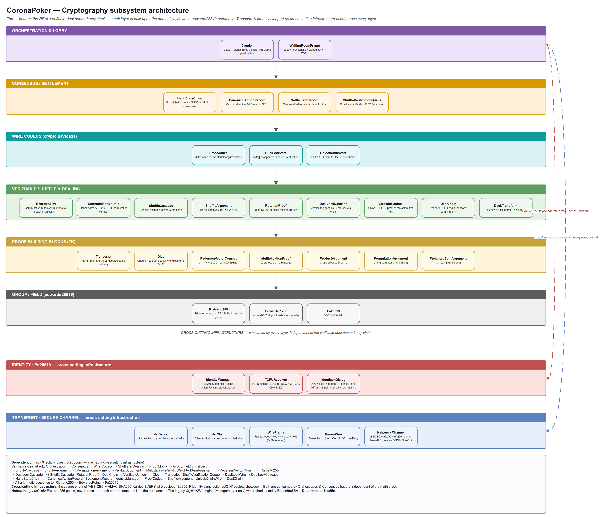
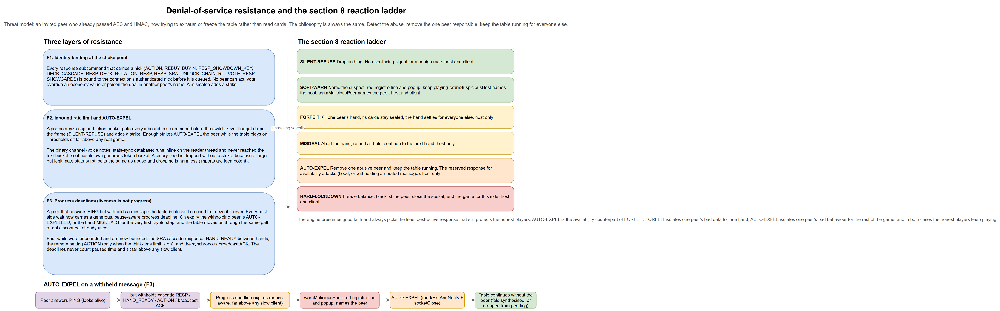

<div align="justify">

# Security architecture

How CoronaPoker enforces the "nobody cheats, not even the host" promise. This document covers the cryptographic primitives, the data flows that bind them together, and the failure modes they detect. File and line references are kept current with the codebase. The deeper internal spec for the identity layer lives in [`ec-identity-spec.md`](ec-identity-spec.md).

---

## Diagrams

Three reference diagrams give the whole picture at a glance. Editable `.drawio` sources sit next to the PNGs in [`diagrams/`](diagrams/).

### Component architecture

The layers of the crypto subsystem and how they depend on one another, namely the verifiable-deal stack (orchestration down to edwards25519 arithmetic) plus the cross-cutting secure-channel and Ed25519 identity infrastructure.



### Per-hand protocol sequence

Every cryptographic message exchanged during **one complete hand**, covering handshake and identity pinning, the SRA shuffle/rotation cascade, verifiable dealing, signed betting, the verifiable community reveals for all four streets, the showdown key reveal, and the settlement-receipt consensus. Topology: the host (dealer + player) plus two human clients. Every message is drawn explicitly.


### Denial-of-service resistance and the reaction ladder

The availability side of the same threat model, covered in detail in §8. The three layers that stop an authenticated peer from exhausting or freezing the table, the six-tier reaction ladder from SILENT-REFUSE to HARD-LOCKDOWN, and the pause-aware progress deadline that turns a withheld message into an AUTO-EXPEL instead of a permanent freeze.



---

## 1. Threat model

| Adversary | Defended? | How |
|---|---|---|
| Hostile host trying to peek at a peer's pocket cards | Yes | SRA over **Ristretto255** + **verifiable dealing**: every de-lock carries a chained DLEQ proof anchored to the committed deck, so the host cannot use a peer as a blinded-decryption oracle (§2.5). Pockets stay multi-locked until the owner releases their key at showdown |
| Hostile host trying to peek at community cards before their street | Yes | Same verifiable-dealing chain applied to the community deal + GATE-6 genesis check. The street gate only opens in lockstep with local betting (§2.5, §8) |
| Hostile host **smuggling** a card (duplicate, or relocate a pocket into the community half) to read it | Closed | The shuffle and rotation are proven honest with a zero-knowledge **verifiable shuffle** (§2.6), broadcast and verified **independently by every peer** against its own deck. A smuggle is a non-permutation that no proof can pass. Anti-replay on the rotation and the real-time de-lock guards (§2.5) remain as the inner layer |
| Hostile host or peer rewriting hand history | Yes | Per-action Ed25519 signatures + `H_t` ratchet committed by every peer in a signed receipt. The receiver also **binds each signed record to the action it actually played** (type, amount, player id, hand id), so a peer cannot sign one thing and play another (§5.1) |
| Hostile host or peer reporting a false pot payout | Yes | Every peer recomputes the hand's settlement independently and binds it into `H_final` as a terminal record. A divergent payout diverges the signed receipt (§5.4) |
| Network MITM on the ECDH handshake | Yes (with password) | HMAC-SHA512 binding of the shared secret to a table password. Session-key identicon for OOB compare (waiting room, right-click your own nick) |
| Replay or tampering of game commands on the wire | Yes | AES-256-CBC with per-command IV + HMAC-SHA256 over `IV \|\| ciphertext` |
| Java deserialization gadgets via RECOVERDATA | Yes | Strict `ObjectInputFilter` whitelist (HashMap / String / numeric boxes only, 10 MB cap, depth 20) |
| Off-curve / weak-point attacks on the SRA cascade | Yes | Ristretto255 canonical-encoding validation on every received point (prime-order group ⇒ no small-order / non-canonical ambiguities), atomic security lockdown on failure |
| Card substitution at showdown | Yes | Pocket key reveals signed under a domain-separated context. Mismatch aborts the hand |
| Cross-recipient board fork (host announces different community cards to different peers) | Yes | Host signs community-card announcements. Signature absorbed into every recipient's `H_t` |
| Authenticated peer flooding to exhaust host resources | Yes | Per-peer size cap and token bucket on the text command path, plus a separate bucket for the binary channel. Over budget drops the frame, enough strikes AUTO-EXPEL the peer (§8.4) |
| Authenticated peer answering PING but withholding a message the table needs, to freeze it | Yes | Every host-side wait has a generous, pause-aware progress deadline. On expiry the peer is AUTO-EXPELLED (or the hand MISDEALS) and the table moves on (§8.4) |
| Authenticated peer acting, voting or poisoning the deal in another peer's name | Yes | Every nick-bearing response subcommand is bound to the connection's authenticated nick at the choke point (§8.4) |
| Local trojan / Ring-0 attacker on the victim's machine | No | Identity keys live in `~/.coronapoker/identity_<player_id>.ed25519` with restricted ACLs. A sufficiently privileged local attacker reads them |
| Collusion of N-1 peers against 1 victim | Inherent | Victim sees the divergent receipt in the disputed-hands log and can refuse to settle |

---

## 2. Mental Poker: SRA cascade

The deck is shuffled and locked **collectively**. No single peer ever sees a card before it is legitimately revealed, and no peer (host included) can bias the distribution.

### 2.1 Genesis deck

The 52 cards are mapped deterministically to **Ristretto255** group elements:

- For each card index a 64-byte seed is computed as `SHA-512(CARD_LABEL_PREFIX || index)`.
- The seed is mapped into the group with the RFC 9496 hash-to-group map (Elligator 2), producing a canonical 32-byte Ristretto encoding (`getGenesisDeck` in [`RistrettoSRA.java`](../src/main/java/com/tonikelope/coronapoker/crypto/RistrettoSRA.java), `hashToGroupEncoded` in [`Ristretto255.java`](../src/main/java/com/tonikelope/coronapoker/crypto/Ristretto255.java)).
- Ristretto255 is a **prime-order** group over edwards25519: there is no cofactor to clear and every element has a single canonical encoding, so the off-curve / small-order / non-canonical-encoding ambiguities of the old x-only Curve25519 representation simply do not exist.
- The 52 encodings are the genesis deck. Every peer derives the same deck independently, so nothing has to be sent.

> **Engine.** The pure-Java SRA engine lives under [`crypto/`](../src/main/java/com/tonikelope/coronapoker/crypto/) (`Fe25519`, `EdwardsPoint`, `Ristretto255`, `RistrettoSRA`, `Dleq`), anchored to the RFC 9496 test vectors. The Mental-Poker group is **Ristretto255**. The ECDH **channel** handshake (§3) uses Curve25519, a separate, lower-layer use of the curve for a different purpose.

### 2.2 Lock-permute-rotate

Each peer holds two ephemeral scalars per hand: a **pocket** scalar `k_pocket` and a **community** scalar `k_community`. The cascade walks around the ring:

1. **Pocket lock pass.** Player 1 multiplies every card by their `k_pocket`, permutes the deck with a deterministic AES-256-CTR shuffle (see §2.4), and forwards. Player 2 does the same on top of player 1's output. By the time the deck returns to the dealer, every card has been locked once per ring member with their `k_pocket`, in a permutation nobody fully knows. This becomes the `MEGAPACKET`.
2. **Community rotation pass.** A separate pass walks the community-card slots and *rotates* each peer's lock: every peer strips its own `k_pocket` from the slot and re-locks it under its `k_community`. Pocket cards keep the full `k_pocket` chain untouched. Community cards end up locked **only** under each peer's `k_community` (the pocket locks are gone). The rotation is **single-use per cascade** (anti-replay): a second rotation request without a fresh cascade is refused, since serving it would turn the rotation into a covert pocket-unlock oracle (§2.5, §8). (`DECK_ROTATION_REQ` handler in [`WaitingRoomFrame.java`](../src/main/java/com/tonikelope/coronapoker/WaitingRoomFrame.java), rotation scalars in [`Crupier.java`](../src/main/java/com/tonikelope/coronapoker/Crupier.java).)
3. **Pocket dealing (verifiable).** Each pocket card travels to its owner with all *other* peers' `k_pocket` already inverted, only the owner's own `k_pocket` remains, which the owner inverts locally. **Every de-lock step carries a Chaum-Pedersen DLEQ proof chained from the committed `MEGAPACKET` point** ([`DealChain.java`](../src/main/java/com/tonikelope/coronapoker/crypto/DealChain.java), [`VerifiableUnlock.java`](../src/main/java/com/tonikelope/coronapoker/crypto/VerifiableUnlock.java)), so a peer refuses to act as a blinded-decryption oracle, since the host cannot feed in a blinded `r·P` to de-lock (§2.5).
4. **Community reveal per street (verifiable).** The community deal runs over the **same proof-chained de-lock** anchored to the `MEGAPACKET`, plus a genesis-check (GATE 6): if stripping our lock would reveal a card, it is extraction and is refused. The street gate only opens once the local betting machine has reached that street (anti early-cascade, §8). The host collects the unlocks, exposes the card to the table and absorbs a host-signed announcement into every peer's `H_t` (see §5).

Pockets never receive community-key unlocks. Community cards never receive pocket-key unlocks. The two locks live in disjoint scalar spaces.

### 2.3 Showdown reveal

When a player reaches showdown they broadcast `RESP_SHOWDOWN_KEY` containing their `k_pocket` and a 64-byte Ed25519 signature over `"SHOWDOWN" || HAND_ID || nick || k_pocket`. Every peer:

- Validates the signature against the peer's pinned Ed25519 pubkey.
- Applies `k_pocket` to the single-locked residual the peer received during dealing.
- Decodes the resulting curve point to a card index by looking it up in the genesis deck.
- Cross-checks the result against the announcement the host broadcast.

Any mismatch (bad signature, unknown point, conflicting announcement) triggers `SECURITY_LOCKDOWN` (§8) and the hand is aborted before any chips move.

### 2.4 Deterministic shuffle

The permutation each peer applies is generated with **AES-256-CTR** seeded by a per-hand key, then converted to a Fisher-Yates shuffle using **rejection sampling** to eliminate modulo bias ([`DeterministicShuffle.java`](../src/main/java/com/tonikelope/coronapoker/DeterministicShuffle.java), `shuffleDeck`, with the unbiased index draw in `DeterministicStream.getUnbiasedInt`). The seed is fresh per hand, so reordering carries no information across hands.

### 2.5 Verifiable dealing: closing the blinded-decryption oracle

An SRA cascade has a subtle, devastating weakness if de-locks are unauthenticated: the host can use any peer as a **blinded-decryption oracle**.

**The attack.** The host holds a peer's single-locked pocket point `P = k·G_card` (broadcast as `POCKET_CARDS`). It picks a random blinding scalar `r`, sends the peer `r·P` (relabelled as another slot, fresh tag) and asks it to "unlock". The peer applies `k⁻¹` → `r·G_card`, which is **not** a genesis card (it is blinded), so a genesis-only check passes and the peer returns it. The host multiplies by `r⁻¹` and recovers `G_card`, the hole card. Multiplicative blinding slips straight past a genesis-only check.

**The fix: chained de-locking with DLEQ proofs.** Each peer commits, per hand, to `K = k·B` for both its pocket and community scalars. These commitments travel in the `MEGAPACKET` and are **bound into `H_0`** (§5.2). When a peer strips its lock it publishes, alongside the result, a Chaum-Pedersen **DLEQ proof** that it used exactly its committed `k` ([`Dleq.java`](../src/main/java/com/tonikelope/coronapoker/crypto/Dleq.java), [`VerifiableUnlock.java`](../src/main/java/com/tonikelope/coronapoker/crypto/VerifiableUnlock.java)). De-locks form a **chain** that must start at the committed `MEGAPACKET` point and where every link carries a valid proof under a committed key ([`DealChain.java`](../src/main/java/com/tonikelope/coronapoker/crypto/DealChain.java)).

A blinded `r·P` cannot anchor: the chain would not start at the committed bytes, and **nobody committed the factor `r`**, so no valid proof exists, and the peer refuses. The host can only ask peers to de-lock points that provably descend from the committed deck, i.e. the legitimate dealing.

Two further guards close the back doors found while hardening this:

- **Self-strip guard (pockets).** A peer reads `megapacket[offsetBase]` *locally by index* and never de-locks a point inside its own pocket slot `[mySlot·2, mySlot·2+1]`, so a host that decouples the labelled `peerIdx` from the stripped point cannot make a peer reveal its own cards.
- **GATE 6 (community).** When a peer strips its *own* community lock, the result must still be wrapped in the other peers' locks, so it should look like noise, never a real card. If instead the residual already resolves to a genuine (genesis) card, then every *other* lock was already gone and the host is using this peer as the **final** unlock to expose a board card before its street is due → refused. (The DLEQ binding of the fix above makes multiplicative blinding impossible, so a forged value cannot be dressed up to slip past this genesis-check.)

All dealing flows through a single proof-chained channel (`REQ_SRA_UNLOCK_CHAIN`): no peer ever serves an unlock outside the proof chain, so a point that does not provably descend from the committed deck simply cannot be de-locked.

The chain above proves each de-lock is honest, but it does not by itself prove the **deck** is honest (that it is a genuine permutation of 52 distinct cards with nothing duplicated or relocated between the pocket and community halves). That is §2.6.

### 2.6 Verifiable shuffle: proving the deck is an honest permutation

The de-lock chain (§2.5) stops a peer from being used as a decryption oracle, but the *shuffle and rotation themselves* were not proven honest. A hostile host could produce a **dishonest deck**, duplicating a card or slipping a copy of a player's pocket point into a community slot (the "rotation smuggle"/"exiter" flank), and the de-lock chain would still validate each individual unlock. The deck is now proven honest with a **zero-knowledge verifiable shuffle**, broadcast and checked **independently by every peer**.

- **Cascade (genesis → pre-rotation).** Each peer's shuffle step is attested by a **Bayer-Groth shuffle argument**: the output deck is a genuine permutation of the input, re-locked under a single uniform scalar, with no card duplicated, none relocated, no biased distribution, without revealing the permutation. The chain is **anchored to the recomputable genesis deck** (`decks[0] == genesis`). Each step is verified against the previous *already-verified* deck, so the input points stay discrete-log-independent and a smuggle (a non-permutation) cannot pass. ([`ShuffleArgument.java`](../src/main/java/com/tonikelope/coronapoker/crypto/ShuffleArgument.java), [`ShuffleCascade.java`](../src/main/java/com/tonikelope/coronapoker/crypto/ShuffleCascade.java)).
- **Rotation (pre-rotation → MEGAPACKET).** The dual-lock rotation (§2.2 step 2) does **not** permute. It re-keys every community piece in place with one scalar (`uPocket·kCommunity`). That honesty (`out[i] = s·in[i]`, same scalar, same index, no reorder, no duplication) is proven with a **batch-DLEQ** ([`RotationProof.java`](../src/main/java/com/tonikelope/coronapoker/crypto/RotationProof.java)). Together with the cascade this binds the whole chain genesis → MEGAPACKET, including two structural invariants: the MEGAPACKET pocket region equals the pre-rotation pocket region byte-for-byte, and its community region equals the rotation output ([`DualLockCascade.java`](../src/main/java/com/tonikelope/coronapoker/crypto/DualLockCascade.java)).
- **Broadcast + independent verification.** The host broadcasts the proof bundle (`DUALLOCK_BUNDLE`). **Each peer recomputes the genesis, derives the pocket/community boundary locally (`numPlayers·2`, never trusting the host), and verifies the entire chain against its own MEGAPACKET** ([`DualLockWire.java`](../src/main/java/com/tonikelope/coronapoker/crypto/DualLockWire.java)). A dishonest deck fails the proof on every honest peer → soft warning (§8.2). The host verifying itself proves nothing. The security is that the *other players* verify.
- **Require-the-proof gate.** Before a peer helps reveal community cards (the only window where a smuggled card could be read), it checks it has verified an honest-shuffle proof for that exact deck. A host that smuggles and simply *omits* the bundle is caught here (soft warning), recover-safe (a recovered deck, verified before the crash, is not re-required).
- **Zero-knowledge & cost.** The proofs reveal nothing about the permutation or the locks. Both the proving and the verifying are **decoupled from the deal**. Each peer answers the cascade immediately with its locked/shuffled deck and commitments (`DECK_CASCADE_RESP`) and sends its Bayer-Groth step proof **separately and asynchronously** in a `DECK_CASCADE_PROOF`, matched back to its step by `hash(deckOut)`. The host collects those off the dealing path (`collectAsyncCascadeProofs` in [`Crupier.java`](../src/main/java/com/tonikelope/coronapoker/Crupier.java), bounded window) and only then assembles the `DUALLOCK_BUNDLE`, which it broadcasts during betting. Verification likewise runs in the **background during betting, single-threaded** (`ShuffleVerificationQueue`), with no impact on the dealing animation or CPU. This is why the expensive prove (tens of ms to several seconds on slow hardware) never stalls dealing. A proof that never arrives degrades to the same *deck-unverified* receipt signal as a proofless peer (§6) — never a wrong deal.

The rotation is under proof, and a smuggle is a non-permutation that no proof can pass. Together with the real-time defenses of §2.5 (which block reading a *live* player's pocket), §2.6 proves the whole deck honest, closing the shuffle/rotation flank in depth.

---

## 3. Channel security

### 3.1 Handshake

When a client connects:

1. The two endpoints exchange ephemeral Curve25519 pubkeys and run ECDH to derive a raw 32-byte shared secret.
2. The shared secret is passed through `Helpers.deriveChannelSecret` ([`Helpers.java`](../src/main/java/com/tonikelope/coronapoker/Helpers.java), `deriveChannelSecret`) to derive the channel key material: with a table password it computes `HMAC-SHA512(key = password, msg = shared_secret)`; with no password it falls back to a plain `SHA-512(shared_secret)` (not an empty-keyed HMAC). Either way the 64-byte output is split into a 32-byte AES-256 key and a 32-byte HMAC key.
3. If the password is configured but weak (`< 60 bits` entropy estimate) the host is warned before the table is created.

A passive MITM cannot complete the handshake **when a password is set**: the channel key is `HMAC-SHA512` keyed on the password over the DH secret, so a wrong password yields a wrong key on both sides and every subsequent command fails HMAC verification on receipt. With **no** password the fallback `SHA-512(dh_secret)` carries no such binding and is unauthenticated on first contact — which is exactly why first-contact MITM without a password is out of scope (§9) and the session-key identicon exists for an out-of-band compare.

### 3.2 Frame format

Every game command on the wire is wrapped as:

```
Base64( HMAC-SHA256(IV || ciphertext, key_hmac)(32) || IV(16) || AES-256-CBC(plaintext, key_aes, IV) )
```

PKCS5 padding for the CBC layer. The MAC covers `IV || ciphertext` (encrypt-then-MAC) and is prepended to the frame. On receipt the HMAC is verified **first**. A bad HMAC raises `KeyException` and the receiver drops the frame ([`Helpers.java`](../src/main/java/com/tonikelope/coronapoker/Helpers.java), `decryptCommand`). This blocks ciphertext tampering and replay of frames with mutated IVs.

### 3.3 Session-key identicon

An "identicon" dialog ([`IdenticonDialog.java`](../src/main/java/com/tonikelope/coronapoker/IdenticonDialog.java) `Mode.SESSION`) renders a deterministic mosaic from `SHA-256(AES key)`, reachable from the waiting room by **right-clicking your own nick** in the participant list. A client opens the mosaic of its single channel with the host. The host opens the per-client grid of all channels ([`SessionIdenticonMosaicDialog.java`](../src/main/java/com/tonikelope/coronapoker/SessionIdenticonMosaicDialog.java)). Peers compare the mosaic visually out-of-band (voice call, in-person glance). Different mosaics mean the handshake was MITM'd, and both sides should disconnect.

---

## 4. Per-nick cryptographic identity

### 4.1 Keypair storage

Each install carries an `Ed25519` keypair per nick, stored at:

```
~/.coronapoker/identity_<player_id_hex>.ed25519
```

Where `player_id_hex` is the first 8 bytes of `SHA-256(NFC(nick) UTF-8)` ([`IdentityManager.java`](../src/main/java/com/tonikelope/coronapoker/IdentityManager.java), `playerIdHex`). The file is created with:

- **POSIX**: `Files.setPosixFilePermissions(rw-------)` (read/write owner only).
- **Windows**: ICACLS reset → grant FULL CONTROL only to the current SID → strip inheritance.

Identity binding is per-nick, not per-machine: re-using the same nick on the same machine reuses the same Ed25519 key.

### 4.2 Domain-separated signing contexts

Four application-level contexts are signed under distinct prefixes so a signature collected in one context cannot be replayed in another:

| Context | What it signs |
|---|---|
| `"ACTION"` | A `CanonicalActionRecord` (see §5), covering every bet, check, call, fold, raise, all-in, community announce |
| `"RECEIPT"` | `HAND_ID \|\| H_final \|\| flags`, the final receipt sent to every peer at the end of the hand |
| `"SHOWDOWN"` | `HAND_ID \|\| nick \|\| k_pocket`, releasing one's pocket key at showdown |
| `"JOIN"` | The join handshake commitment that pins the pubkey on first contact |

The internal spec [`ec-identity-spec.md`](ec-identity-spec.md) covers each context in full detail (replay defenses, encoding rules, what each field commits to).

### 4.3 TOFU & identicon verification

The first time a pubkey is observed for a given nick the resolver pins it ([`TOFUResolver.java`](../src/main/java/com/tonikelope/coronapoker/TOFUResolver.java)). A `Mode.IDENTITY` identicon dialog renders the same deterministic mosaic over `SHA-256(pubkey)` for OOB comparison. Clicking "verify" upgrades the entry from TOFU to "user-verified", remembered across sessions.

---

## 5. Canonical action records & `H_t` ratchet

### 5.1 Action record

Every hand action is encoded into a fixed 92-byte record ([`CanonicalActionRecord.java`](../src/main/java/com/tonikelope/coronapoker/CanonicalActionRecord.java)):

```
Offset Size  Field           Notes
  0    32    PREV_H          H_{t-1}
 32    16    HAND_ID         16 random bytes from host at hand start
 48    32    PLAYER_ID       SHA-256(NFC(nick) UTF-8)
 80     1    STREET          preflop/flop/turn/river/showdown
 81     1    ACTION_TYPE     bet/call/raise/fold/check/all-in/community
 82     8    AMOUNT_CENTS    int64 BE, cents (host-independent)
 90     2    FLAGS           bit0 is_allin, bit1 is_voluntary
```

For an `ACTION_COMMUNITY` record (a host-signed community-card reveal, §5.3) the `AMOUNT_CENTS` field is repurposed to carry the revealed card ordinals: each card is packed into one byte (`packCommunityCards` / `unpackCommunityCards` in [`CanonicalActionRecord.java`](../src/main/java/com/tonikelope/coronapoker/CanonicalActionRecord.java)), up to 3 cards for the flop. The layout is otherwise identical.

Cross-platform reproducibility relies on:

- NFC normalization of the nick before UTF-8 (precomposed vs decomposed unicode parity across OSes).
- Float → cents through `amountToCents` (widens to double before scaling, kills `0.1f + 0.2f` jitter).
- Big-endian for every multi-byte integer.

This encoder is the **single source of truth** for action serialization. Any other path that reproduced the layout inline would be an integrity bug.

**Binding the record to the played action.** Verifying the signature only proves the actor signed *some* record. It does not prove the record matches what they actually played on the live wire (`decision`, `bet`). So after the signature verifies, the receiver also checks that the record's `ACTION_TYPE`, `AMOUNT_CENTS`, `PLAYER_ID` and `HAND_ID` equal what the played action and the receiver's own replicated pre-action state imply (`Crupier.signedRecordBindsToAction`). The amount is recomputed with the exact formula the signer used (`expectedActionAmountCents`: fold 0, check/call to the current bet, bet to the wire target, all-in to bet plus stack); the type maps straight from the wire decision; the player id and hand id are stable identifiers. Because every peer runs the same formula over the same replicated state, an honest action always matches, so this never fires in a healthy hand. A mismatch (a peer that signs one amount, type or player while playing another) is treated exactly like an invalid signature: a symmetric synth-fold on every receiver plus the `saw_invalid_action_sig` flag, so the closing consensus records it. This closes the gap where a modified client could put a false figure into the signed history while the live pot used the plaintext.

### 5.2 Chain

Each hand opens with `H_0`, a SHA-256 commitment that binds: the domain separator, the `HAND_ID`, the player set, **every peer's per-hand key commitments** `K_pocket = k_pocket·B` and `K_community = k_community·B`, and the cascaded-deck hash. Those `K` commitments are exactly what the verifiable dealing checks its DLEQ proofs against (§2.5). The keys a peer must prove it used are fixed at hand start, in the same chain every peer commits to. The **exact byte layout** ([`HandStateChain.java`](../src/main/java/com/tonikelope/coronapoker/HandStateChain.java) `start`) is specified once in [`ec-identity-spec.md`](ec-identity-spec.md) §5.1, the single source of truth for the format.

Then every action ratchets the chain:

```
H_{t+1} = SHA-256(record_t || sig_t)
```

The deck commitment inside `H_0` binds the chain to the *exact* permutation produced by the cascade, so peers that walked a different cascade end up with a different `H_0` and their chains diverge on the very first absorb.

Signatures land **inside** the ratchet: tampering with a record OR with the signature breaks `H_{t+1}` for every observer.

### 5.3 Host-signed community announcements

The same record format covers community-card reveals (`ACTION_COMMUNITY`). The host signs the announcement. Every recipient verifies and absorbs. Without this, a hostile host could announce a different flop to different peers and leave no chain-level evidence. With this, the announcement is part of `H_t`, so the divergence becomes observable in the receipt.

### 5.4 Terminal settlement record

After the last action and community reveal, each peer folds the hand's **settlement** into the chain as a terminal record: the per-player amounts contributed to the pot and paid from it, plus the odd-chip remainder. Every peer computes the settlement independently from the same inputs (the showdown cards it verified against genesis and the bets already committed in the chain), so honest peers produce the same table, and a peer that reports a different payout diverges on `H_final`.

```
settlement = HAND_ID(16) || N(uint8)
             || per participant, sorted by PLAYER_ID:
                  PLAYER_ID(32) || bote_cents(int64 BE) || pagar_cents(int64 BE)
             || sobrante_cents(int64 BE)        // odd-chip remainder, credited to no player

H_final = SHA-256("SETTLE\0" || H_t || settlement)
```

Amounts are integer cents (chip precision, host-independent) and participants are sorted by `PLAYER_ID`, so map iteration order never changes the bytes ([`SettlementRecord.java`](../src/main/java/com/tonikelope/coronapoker/SettlementRecord.java) is the single source of truth for the layout). The record carries no separate signature. It rides the closing receipt, whose Ed25519 signature already covers `H_final`, and no extra wire message is involved: the settlement is a local absorb attested by the same receipt exchange (§6).

---

## 6. Receipts & consensus

At the end of the hand every peer emits a **receipt**:

```
HAND_ID(16) || H_final(32) || flags(1) || sig(64)   =  113 bytes
```

Where:

- `H_final` is the final value of the `H_t` ratchet, closing over the terminal settlement record (§5.4) after the last action and community reveal, so a matching `H_final` attests agreement on the pot payout as well as the action history and board.
- `flags.bit0` is set if the peer observed any invalid Ed25519 signature during the hand.
- `flags.bit1` is set if the peer could **not** confirm the honest-shuffle proof (`DUALLOCK_BUNDLE`, §2.6) for this hand's deck. This binds the verifiable-shuffle verdict into the signed record, so the receipt attests deck honesty, not just action agreement. A peer sets the bit verified when it checks the bundle (client), when its background full-chain self-verify passes (host), or when it restores a hand on recover (the deck was verified pre-crash and the fossil is the peer's own). Otherwise the bit stays unverified.
- `flags.bit2` **qualifies** bit1: it is set only when the peer expected a proof (a fresh deal, not a recover) and **no** `DUALLOCK_BUNDLE` ever arrived for this deck. It distinguishes a host that **withholds** the proof (bit1+bit2, suspicious, even if only some peers are starved) from a **slow peer** whose bundle did arrive but whose verification queue has not finished yet (bit1 only, benign, self-correcting). The reception marker is set when the command arrives, before parsing, so an extremely slow verifier never trips bit2.
- `sig` is `Ed25519(privkey, "RECEIPT" || HAND_ID || H_final || flags)`. All flag bits are inside the signed payload, so a host relay cannot strip them.

The host gathers the receipts from every peer and relays them to every other peer. The consensus check ([`Crupier.java`](../src/main/java/com/tonikelope/coronapoker/Crupier.java), `waitForHandverifyTrigger` and the surrounding consensus loop) reports the strongest anomaly it finds, in priority order: **divergent** `H_final` (alert) > **missing** receipt (warning) > `flags.bit0` **invalid-sig-seen** (warning) > `flags.bit1+bit2` **no-shuffle-proof** (warning) > `flags.bit1` alone **deck-pending** (silent) > clean (info).

The two lowest buckets are deliberately split. **No-shuffle-proof** (bit1+bit2) means a host did not deliver the proof to one or more peers. A correct host always does, so it warns the whole table (popup), without blocking settlement or accusing anyone, since it could equally be a modified version or a software bug. **Deck-pending** (bit1 alone) means the proof arrived but a peer's machine is just slow to verify it. That is pure noise to everyone else, so it is recorded as silent forensic evidence (JUL log + `disputed_hands` row) with **no popup and no in-game registro line**, the same policy as the TOFU-NEW notice. The deferred verification stays alive regardless and raises its own live warning if it ever *proves* dishonesty. Consensus still passes (chips move) when only bit1 is set somewhere. A clean OK requires every `sig` to verify, every `H_final` identical, and no flag bit set anywhere.

Any anomaly is logged into the `disputed_hands` table of the local SQLite (row types `DIVERGENT`, `MISSING`, `INVALID_SIG_SEEN`, `DECK_NO_PROOF`, `DECK_UNVERIFIED`). The hand is not unwound (chips already moved), but the dispute is archivable evidence with cryptographic signatures attached.

---

## 7. Crash recovery & late joiners

### 7.1 SQLite checkpoint

Every action, every balance change and every cascade outcome is persisted to a local SQLite database (`~/.coronapoker/coronapoker.db` typically). The tables of interest:

- `game`, `hand`: game and hand metadata, including BUYIN, blinds, dealer/SB/BB nicks, `hand_id_b64` (cryptographic HAND_ID), and `preflop_players` (the b64-encoded nick list of who sat down preflop).
- `balance`: per-hand player stack snapshots.
- `action`: every action as a canonical record, with the signing peer's signature alongside.
- `showdown`, `showcards`, `permutationkey`: showdown evidence (signed pocket-key reveals included).
- `hand_state`: the **hand fossil**, see §7.2.
- `disputed_hands`: receipt anomalies (see §6).
- `known_identities`: TOFU-pinned Ed25519 pubkeys.

### 7.2 Hand fossil

The fossil is a single row keyed by `id_game` (INSERT OR REPLACE) containing everything the peer needs to resume mid-hand:

| Tag | Contents |
|---|---|
| `ORDER@` | b64-encoded nick list defining the ring permutation |
| `FULLMEGAPACKET@` | The cascaded deck after every peer's lock pass |
| `SRAKEYS@` / `SRAKEYS_COMMUNITY@` | The local peer's pocket / community unlocks |
| `BOTKEYS@`, `BOTKEYS_COMMUNITY@`, `BOTVISUAL@` | Equivalents for any local bots in the ring |
| `POCKETS@` | Single-locked pocket residuals received from peers (for showdown verification) |
| `VISUAL@` | The local peer's visible hole cards |

Source: [`Crupier.java`](../src/main/java/com/tonikelope/coronapoker/Crupier.java), `guardarFosilSRA`. The fossil never contains another peer's pocket scalars, so reading it does not leak anything that would not be revealed at showdown anyway.

### 7.3 Resume flow

On `continue-last-game`:

- The host reads SQLite, rebuilds dealer/SB/BB and re-derives blinds, and broadcasts a `RECOVERDATA` payload to every reconnecting client.
- Each client reads its own SQLite, loads its fossil (if any), re-injects the SRA state, then absorbs the persisted actions to rebuild the `HandStateChain` and verify signatures along the way.
- Recovery is **per-peer**: a late joiner who was never in the in-progress hand watches it as a passive observer (no cards dealt, no actions requested) and joins normally on the next hand. Cross-checking `preflop_players` from the host map against the local nick is what distinguishes a returning participant from an observer ([`Crupier.java`](../src/main/java/com/tonikelope/coronapoker/Crupier.java) `recuperarDatosClavePartida` client branch).
- The RECOVERDATA payload is deserialized with a strict `ObjectInputFilter`: only `HashMap`, `String`, `Integer`, `Long`, `Float`, `Double` and `Boolean`, capped at 10 MB, 20 levels deep, and 10 000 array elements max. This blocks classic Java deserialization gadget chains.

---

## 8. Reacting to a cryptographic / security failure

Every cryptographic check has a **defined, role-aware reaction**. The reaction depends on **who detects the fault** (a client and the host have different tools) and on **what is at stake** (one peer's data vs the whole table). All reactions **presume good faith**: an anomaly may be a software bug, not an attack, so the engine never accuses anyone and always prefers the *least destructive* response that still keeps honest players safe.

### 8.1 The six reactions

| Reaction | What it does | Who can use it |
|---|---|---|
| **SILENT-REFUSE** | Drop the operation and log it. No user-facing signal for a benign race. A security-significant refusal is escalated to SOFT-WARN or higher so it is never silent | host & client |
| **SOFT-WARN**: `warnSuspiciousHost` / `warnMaliciousPeer` | Inform the user, name the suspect, strongly recommend leaving (client side), **keep playing** | host & client |
| **FORFEIT** | Kill **one** peer's hand (its cards stay sealed and it cannot win the showdown), and the hand settles for everyone else | host only |
| **MISDEAL**: `cancelarManoYDevolverApuestas` | Abort the hand, **refund all bets**, continue to the next hand | host only |
| **AUTO-EXPEL**: `markExitAndNotify` + `socketClose` | Remove **one** abusive peer from the game and **keep the table running** for everyone else. The reserved response for availability attacks, namely a flood or a peer that answers PING while withholding a message the table needs to move on | host only |
| **HARD-LOCKDOWN**: `triggerSecurityLockdown` | Freeze balance, blacklist the peer, close the socket, **end the game for this side** | host & client |

A **client cannot MISDEAL, FORFEIT or AUTO-EXPEL** (it does not run the hand). Its heaviest tool is to **leave** (lock down its own side). The **host rarely needs LOCKDOWN** because it has the proportionate MISDEAL, FORFEIT and AUTO-EXPEL. Ending the whole game because one peer misbehaves is almost never the right answer. AUTO-EXPEL is the availability counterpart of FORFEIT: FORFEIT isolates one peer's bad **data** for one hand, AUTO-EXPEL isolates one peer's bad **behaviour** for the rest of the game, and in both cases the honest players keep playing.

### 8.2 The decision rule

1. **Benign race**: state not ready yet, or a stale / out-of-order message the protocol naturally produces → **SILENT-REFUSE**.
2. **A client detecting the host:**
   - The host is **provably attacking *me*** to read my cards, whether asked to strip a point in my own pocket slot, GATE 6 (a community strip that reveals genesis early), blinded-decryption oracle, or a chain not anchored to the committed `MEGAPACKET` → **LEAVE** (hard-lockdown my own side).
   - An anomaly **already neutralised by refusing**, which could be a bug, such as a missing or failing shuffle proof (§2.6), a repeated rotation (anti-replay), a payload that is malformed *over the authenticated channel* → **SOFT-WARN**.
3. **The host detecting a peer:**
   - The **hand cannot complete** because a needed unlock/chain did not arrive, or a peer left without a testament → **MISDEAL**.
   - The fault is **isolated to one peer's data**, where its showdown key or reveal won't resolve to a genesis card, or its signature is malformed → **FORFEIT that peer** (its cards stay sealed, the hand settles without it). This is the proportionate response the philosophy reserves for "could be a peer bug": it does not punish the honest players at the table.
   - The fault proves the **global board/deck is forged**, whether a community announcement that disagrees with the unlocks, a cross-recipient fork, plaintext ≠ SRA-decrypt → **MISDEAL** (the board is bad for everyone). **HARD-LOCKDOWN** only if it proves the engine itself is compromised.

### 8.3 Every reaction is visible, and it names the suspect

Every reaction above a benign SILENT-REFUSE surfaces on three channels at once:

1. A **debug log** line through `java.util.logging` for the author reading the logs.
2. A **red line in the in-game registro**. The line carries a translated marker (`security_alert`, `suspicious_alert` or `peer_alert`) that `GameLogDialog` maps to the red `ST_ALERT` style, so the incident stands out from normal play.
3. A **popup** for the player at the table.

The alert **names the suspect** whenever there is one. On a **client**, the party that deals and coordinates is the host, so `warnSuspiciousHost` / `triggerSecurityLockdown` prepend `SUSPECT: host "X"`. On the **host**, the party at fault is a peer, so `warnMaliciousPeer` prepends `SUSPECT: player "X"`. The FORFEIT and MISDEAL sites choose the direction from `isPartida_local()`, so the same anomaly points at the host on a client and at the peer on the host. A benign-race SILENT-REFUSE names nobody because there is no incident to attribute.

The warning is shown **once per distinct anomaly per game** (`warnSuspiciousHost`), or once per **(peer, anomaly)** per game (`warnMaliciousPeer`). This matters twice over. A later, *different* anomaly is never swallowed by an earlier one. And an active attacker cannot turn the visibility itself into a popup flood, which would be a self-inflicted denial of service. The one deliberate exception is `warnDeckUnverified`, which dedups **per hand**: a deck that fails its honest-shuffle proof should never happen in a legitimate game, so every affected hand earns its own alert.

### 8.4 Denial-of-service resistance

The threat here is different from cheating. The adversary is a peer who already passed the AES + HMAC channel (an invited colleague running a modified client) and now tries to **exhaust or freeze** the table rather than read cards or forge results. Liveness answering a PING is not the same as making progress. Three layers close this off, and they all reduce to the same philosophy as §8.2: detect the abuse, remove the one peer responsible with AUTO-EXPEL, and keep the table running for everyone else.

**1. Identity binding at the choke point.** Every response subcommand that carries a nick (`ACTION`, `REBUY`, `BUYIN`, `RESP_SHOWDOWN_KEY`, `DECK_CASCADE_RESP`, `DECK_ROTATION_RESP`, `RESP_SRA_UNLOCK_CHAIN`, `RIT_VOTE_RESP`, `SHOWCARDS`) is bound to the connection's **authenticated** nick before it is queued. A peer cannot act, vote, override an economy value, suppress a reveal or poison the deal **in another peer's name**. A mismatch adds a strike and can AUTO-EXPEL.

**2. Inbound rate limit and AUTO-EXPEL.** Every inbound text command passes a per-peer **size cap** and **token bucket** before the command switch. Over budget drops the frame (SILENT-REFUSE) and adds a strike. Enough strikes AUTO-EXPEL the peer while the table plays on. The thresholds are far above any real game, so an honest client never trips them. The **binary channel** (voice notes and the stats-sync database) is handled inline on the reader thread and never passed through the text bucket, so it has its **own** generous token bucket. A binary flood is **dropped without a strike**: a large but legitimate stats burst is indistinguishable from abuse, and dropping is harmless because imports are idempotent and resume next session. Bounding the arrival rate bounds the downstream work (threads, disk, relay bandwidth) to a constant, since the per-frame work is already size-capped. One layer earlier, before any peer is even authenticated, the accept loop bounds **concurrent handshakes** with a semaphore (`handshake_slots`): a fresh connection only proceeds to its EC key exchange if a slot is free, otherwise it is dropped at once. A connection flood therefore cannot spawn unbounded threads or key generations, and a legitimate join simply retries. This matters least in the "invited colleagues" model (no anonymous scanners) but closes the pre-auth exhaustion vector anyway.

**3. Progress deadlines.** A peer that answers PING but withholds a message the table is blocked on used to freeze it **forever**. Every host-side wait now carries a **generous, pause-aware progress deadline**. On expiry the withholding peer is AUTO-EXPELLED (or, for the very first crypto step, the hand MISDEALS) and the table moves on through the same path a genuine disconnect already uses. Four waits were unbounded:

| Wait | Was | Now |
|---|---|---|
| SRA cascade response (`requestRemoteCascade`) | infinite, plus a livelock on invalid crypto | deadline, then MISDEAL (peer alive) or restart without it (peer gone); repeated refusal AUTO-EXPELS |
| `HAND_READY` between hands | infinite | deadline, then AUTO-EXPEL |
| Remote betting `ACTION` | infinite | deadline gated on the think-time limit, then AUTO-EXPEL |
| Synchronous broadcast ACK (`broadcastGAMECommandFromServer`, plus the two recovery broadcasts) | infinite retry | deadline, then AUTO-EXPEL |

Three properties keep these deadlines from ever punishing an honest player. They are set **far above** any legitimate slow client or slow-PC crypto. They **do not count paused time, nor time while any peer is reconnecting** (this is exactly the condition under which each client freezes the acting player's think-time countdown, so the host stays in lockstep with the clients and never expels an honest player who is simply waiting out someone else's network blip). And a genuinely dead peer still leaves through the normal socket-death path (`isExit`), not through the deadline. The betting deadline has one extra guard: it only applies when the **think-time limit is enabled** (the default). With think-time disabled the game allows unlimited thinking on purpose, so a withheld action cannot be told apart from a human taking their time, and the remedy there is a manual kick.

Because a single refusal or one slow reveal might be a bug, the deadlines respond proportionately. The cascade and rotation MISDEAL first and only AUTO-EXPEL a peer that forces **several** cancellations in a row (a same-version client never produces invalid crypto or withholds past the deadline, so a repeat is unambiguous). This keeps a one-off hiccup from removing anyone while still stopping a peer from looping MISDEALs forever.

The three layers, the six-tier reaction ladder and the withheld-message AUTO-EXPEL flow are drawn together below. Editable `.drawio` source in [`diagrams/`](diagrams/).


---

## 9. What this does NOT defend

For honesty's sake:

- **Timing side-channels in the SRA engine.** The Ristretto255 engine is pure-Java `BigInteger` and is **not constant-time**, prioritising correctness and verifiability over side-channel hardening. In principle a peer's per-hand lock scalars could leak through operation timing. In practice it is not exploitable in this threat model: the lock scalars are **ephemeral per hand** (no way to average many measurements of the same secret), the multiplications happen locally while only results travel the wire, and microsecond-scale variation is buried under millisecond network jitter. The adversary here is a host recompiling the client, not a co-located side-channel attacker measuring your CPU.
- **Local trojan on a peer's machine.** Anyone with read access to `~/.coronapoker/identity_*.ed25519` becomes that peer cryptographically.
- **Coercion / shoulder-surfing.** A peer who shows their screen to someone behind them is leaking pockets out-of-band.
- **N-1 collusion.** Pure consensus systems cannot detect this. The victim will see divergent receipts and can choose not to settle.
- **First-contact MITM without password.** TOFU has no anchor on first contact. The identicon dialog exists precisely to give you an OOB comparison option. Always pin a password for first-time games with new peers.
- **The optional Google Translate TTS** for fast-chat readout makes outbound requests to `translate.google.com`. Disable TTS if you want a fully air-gappable session.
- **Unlimited thinking with the think-time limit disabled.** When the table turns the think-time limit off, the game allows a player to think for as long as they want, on purpose. The host cannot then tell a slow human apart from a peer withholding its action, so it imposes no betting deadline in that mode. A player who stalls the table this way is removed with a **manual kick**, not automatically.
- **A hostile host making a client's table unpleasant.** The verifiable crypto already stops a hostile host from cheating (reading cards, rigging the deck, forging results, stealing chips), and the binary side channel is now rate-limited on the **client** as well as the host, so a host cannot flood a client's machine (voice or stats-sync frames) any more than a client can flood the host: over-rate frames are dropped as harmless backpressure. What a hostile host can still do is refuse to deal or stall the game, and the client's remedy for that is the one it always has, which is to leave.
- **A griefer imposing bounded stalls via pause or repeated reconnection.** The progress deadlines are deliberately lenient. They freeze while the table is paused or while any peer is reconnecting, precisely so an honest slow or reconnecting player is never expelled by mistake. A peer can lean on that leniency to stall the hands it is in, by asserting a pause or by dropping and reconnecting in a loop. Each stall is bounded (a reconnection grace lasts at most about 80 s, and the host can force-resume a pause), and the table always makes progress in between, so this cannot freeze the game outright. But the automated deadline will not remove such a griefer on its own. The remedy is the manual kick the host already has. Choosing leniency here is deliberate, because a false expulsion of an honest player is worse than a bounded, recoverable stall.
- **Reading an auto-mucked loser's cards at showdown.** At a contested showdown every contender reveals its pocket key so that **every** peer can independently recompute the winner (the whole point of zero trust: nobody takes the host's word for who won). The optional "auto-muck" behaviour of the *I Want To See The Hand* rule (`IWTSTH`, **off by default**) then hides the beaten hands **on screen**, but it is a display convenience, not a cryptographic seal: the keys are already on the wire, so a modified client can recompute a mucked loser's cards. This is post-hand information only, with no in-hand or money advantage, and it is inherent to a reveal-all mental-poker showdown. Truly sealing a mucked hand would require an **ordered, player-chosen muck** (each player reveals or concedes in turn, and a conceded hand is never verified), which is a showdown-protocol change deliberately not taken for a default-off, post-hand leak, since it would put the settlement's independent-verification property at risk.

---

## 10. Reading the code

If you want to follow any of the above end-to-end:

- SRA group + verifiable-dealing engine (Ristretto255): [`crypto/`](../src/main/java/com/tonikelope/coronapoker/crypto/), with `Fe25519`, `EdwardsPoint`, `Ristretto255`, `RistrettoSRA`, `Dleq`, `VerifiableUnlock`, `DealChain`
- Verifiable shuffle (§2.6): [`crypto/`](../src/main/java/com/tonikelope/coronapoker/crypto/), with `ShuffleArgument`, `ShuffleCascade`, `RotationProof`, `DualLockCascade`, `DualLockWire`, `ProofCodec`, `PedersenVectorCommit`, `MultiplicationProof`, `ProductArgument`, `PermutationArgument`, `WeightedSumArgument`
- Shuffle primitive: [`DeterministicShuffle.java`](../src/main/java/com/tonikelope/coronapoker/DeterministicShuffle.java) (`shuffleDeck`)
- Cascade orchestration, recovery, lockdown, soft warning, progress deadlines (§8.4): [`Crupier.java`](../src/main/java/com/tonikelope/coronapoker/Crupier.java) (`warnSuspiciousHost`, `warnMaliciousPeer`, `triggerSecurityLockdown`, `requestRemoteCascade`, `readActionFromRemotePlayer`, `broadcastGAMECommandFromServer`)
- Inbound rate limit, AUTO-EXPEL, identity binding at the choke point (§8.4): [`Participant.java`](../src/main/java/com/tonikelope/coronapoker/Participant.java) (`inboundAbuse`, `binaryInboundAbuse`, `registerAbuseStrike`, `autoExpel`, `markExitAndNotify`)
- Channel encryption: [`Helpers.java`](../src/main/java/com/tonikelope/coronapoker/Helpers.java) (`encryptCommand`, `decryptCommand`, `deriveChannelSecret`)
- Identity layer: [`IdentityManager.java`](../src/main/java/com/tonikelope/coronapoker/IdentityManager.java), [`TOFUResolver.java`](../src/main/java/com/tonikelope/coronapoker/TOFUResolver.java)
- Action record format: [`CanonicalActionRecord.java`](../src/main/java/com/tonikelope/coronapoker/CanonicalActionRecord.java)
- Hash chain: [`HandStateChain.java`](../src/main/java/com/tonikelope/coronapoker/HandStateChain.java)
- Identicons: [`IdenticonDialog.java`](../src/main/java/com/tonikelope/coronapoker/IdenticonDialog.java), [`SessionIdenticonMosaicDialog.java`](../src/main/java/com/tonikelope/coronapoker/SessionIdenticonMosaicDialog.java)

Deepest spec (motivation, design rationale, wire encoding tables) for the identity layer: [`ec-identity-spec.md`](ec-identity-spec.md).
