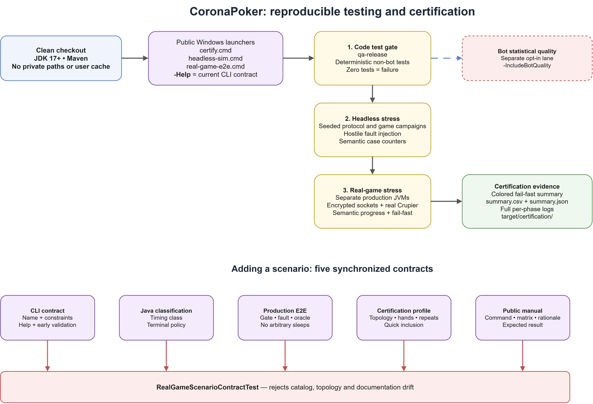

<div align="justify">

# Testing and certification

CoronaPoker keeps its QA tooling outside the distributed game artifact. This
manual is the canonical reference for test lanes, deterministic protocol
campaigns, real multi-JVM game simulation, certification profiles and adding
regressions.



The test suite lives in its own Maven module, **`tools/qa`**, kept deliberately separate from the game: `mvn package` at the repo root builds and ships the game **without** compiling or running a single test. The tests are maintainer tooling, not part of the distributed jar.

## Returning to the project

From a clean clone, install JDK 17 or newer and Maven, open a terminal at the
repository root and run:

```powershell
.\tools\qa\certify.cmd -Help
.\tools\qa\certify.cmd -Mode quick
.\tools\qa\certify.cmd -Mode fast
.\tools\qa\certify.cmd -Mode stress
```

The first command is the current executable reference. `quick` is a critical
iteration subset; `fast` traverses every real-game scenario once with short
campaigns; `stress` is the deep release gate after `fast` passes. `balanced`
remains the default single-command gate when a stress run is not planned. A
valid certificate ends with `CORONAPOKER CERTIFICATION PASS`, exits with code
zero and writes `summary.csv`, `summary.json` and full phase logs under the
printed `target/certification/<timestamp>` directory. Do not infer success from
a live JVM, CPU use, Maven `BUILD SUCCESS`, or an incomplete continuation run.
Every invocation without `-Seed` generates and prints a fresh base seed, which
is also stored in both summaries. Replay a failure with the reported
`-Seed <value>`; do not replace the failing seed until the defect is fixed.
Fresh entropy varies both harness schedules and the production-code paths they
exercise, so it can expose defects on either side of that boundary.
After that replay is green, rerun the affected scenario with a fresh seed. A
narrow fix then resumes at the failed scenario/repetition and the final code
must pass the complete `fast` matrix again. Restart `stress` only when the fix
touches shared protocol/game paths, common harness semantics, entropy/scheduling
or another surface capable of invalidating earlier phases. Continuation evidence
alone never certifies a release.
Bot statistical quality is deliberately absent unless explicitly requested
with `-IncludeBotQuality` after bot AI/evaluation changes.

They are **JUnit 5**. Deterministic game-code tests are kept in the fast lane;
the expensive tests carry `@Tag("slow")` and are split by purpose. The normal
QA command never runs bot-quality simulations: every bot-quality class,
including the headless bot smoke, is tagged slow and only selected by the
explicit `qa-bots` profile.

- **Fast lane (the default)** — domain, money, parsers, protocol and deterministic
  smoke tests; more than 1,000 assertions/tests on the current tree. Exact counts
  are reported by Surefire and intentionally not frozen in this manual.
- **`qa-bots`** — bot-quality statistics, matchups, Monte-Carlo hand potential
  and the headless bot game-flow smoke. Its result is quality evidence for bots,
  not a substitute for a game-code regression test.
- **`qa-crypto`** — cryptographic performance, differential and cascade tests.
- **`qa-network`** — slow real-socket/stall integration checks.
- **`qa-heavy`** — aggregate of the non-bot slow lanes; statistical bot quality
  remains separate. **`qa-release`** runs fast plus the non-bot slow lanes.
  The slow lanes are never part of the normal/default run.

Each slow profile explicitly enables the `slow` tag and clears the default
exclusion, so a successful slow-lane run must report at least one executed
test. A `BUILD SUCCESS` with `Tests run: 0` is an invalid QA result and should
be treated as a profile/classpath problem.

## Running the tests

The easiest and most isolated entry point on Windows is
`tools/qa/certify.cmd`, documented below. For direct Maven runs on any
supported development platform, use the **opt-in QA reactor**
(`tools/reactor/pom.xml`) with at least the `verify` lifecycle. The QA module consumes
the packaged game JAR, so stopping the reactor at `test` is invalid: the game
classes have been compiled but its JAR is not yet available to QA. `verify`
builds the game and tests the same checkout without any manual pre-install or
version override:

```bash
# Fast lane — the default. Game + all deterministic code tests (~1 min).
# Bot-quality simulations are excluded by the slow tag.
mvn -f tools/reactor/pom.xml verify
# Explicit equivalent for CI/NetBeans scripts:
mvn -f tools/reactor/pom.xml verify -P qa-fast

# Bot-quality lane only (statistical; does not replace fast game tests).
mvn -f tools/reactor/pom.xml verify -P qa-bots

# Heavy crypto lane only.
mvn -f tools/reactor/pom.xml verify -P qa-crypto

# Slow real-socket integration lane only.
mvn -f tools/reactor/pom.xml verify -P qa-network

# Aggregate non-bot slow lanes.
mvn -f tools/reactor/pom.xml verify -P qa-heavy

# Everything except statistical bot quality: fast + non-bot slow lanes.
# Run before a release; use -P qa-bots only when bot quality is explicitly in scope.
mvn -f tools/reactor/pom.xml verify -P qa-release

# A single test class (the flag skips the test-less game module).
mvn -f tools/reactor/pom.xml verify '-Dtest=PotMathTest' '-Dsurefire.failIfNoSpecifiedTests=false'
```

GitHub Actions generates and prints a fresh OS-random `QA_SEED`, then runs
`mvn -B -ntp -f tools/reactor/pom.xml -P qa-release verify
"-Dqa.sim.seed=$QA_SEED"` on every push and pull request targeting `master`,
using Temurin Java 17 on Ubuntu 24.04. CI bounds each embedded mass campaign to one wiring case; the
local certifier owns the high-volume seeded campaigns. It uploads
the Surefire reports and built JARs even on failure. The Windows-only
multi-JVM/Swing scenario matrix remains the local certification gate below;
the Linux CI job complements it and does not claim to replace it.

## Game simulation tools (Windows / PowerShell)

One certification command composes the complete local battery. The two lower-level
runners remain available for focused diagnosis:

| Runner | Purpose | Production coverage |
|---|---|---|
| `tools/qa/certify.cmd` | Fail-fast full game certification after a code change | `qa-release`, mass headless campaigns and every real-game scenario below; bot-quality statistics are opt-in |
| `tools/qa/headless-sim.cmd` | Fast seeded campaigns and fault injection | Protocol/domain components, SRA, signed actions, pots, Rabbit/RIT, EXIT/MISDEAL/recovery models, SQLite replay and production bots |
| `tools/qa/real-game-e2e.cmd` | Complete local games in separate JVMs | Real encrypted sockets, `WaitingRoomFrame`, `Crupier.run()`, `rondaApuestas()`, bots, consensus and per-peer SQLite |

The tracked `.cmd` launchers are the public Windows entry points. They apply a
process-local PowerShell execution-policy bypass (without changing the machine)
and preserve the backing `.ps1` runner's exit code. Ask each runner for its
current options:

```powershell
.\tools\qa\certify.cmd -Help
.\tools\qa\headless-sim.cmd -Help
.\tools\qa\real-game-e2e.cmd -Help
```

Typical runs:

```powershell
# Default single-command gate: every deterministic/non-bot lane, bounded mass
# campaigns and every real-game scenario twice.
.\tools\qa\certify.cmd

# Critical iteration subset, full-matrix fast preflight, or deep release gate.
.\tools\qa\certify.cmd -Mode quick
.\tools\qa\certify.cmd -Mode fast
.\tools\qa\certify.cmd -Mode stress

# Fast reproducible protocol campaign.
.\tools\qa\headless-sim.cmd -Hands 5000 -Faults 5000 -BotHands 100 -Seed 42

# One host, two human-client JVMs and one host bot, three complete hands.
# Windows stay hidden; native creation is assigned to monitor 2 first. On a
# single-monitor machine, the runner deterministically uses the highest available monitor.
.\tools\qa\real-game-e2e.cmd -Clients 2 -Bots 1 -Hands 3 -WindowMode hidden -Screen 2

# Long real-socket soak (the supported range is 1..1000 hands).
.\tools\qa\real-game-e2e.cmd -Scenario normal -Clients 2 -Bots 2 -Hands 250

# Production table-size boundaries: ten fully simulated humans, or a full
# mixed table. The host counts as one seat.
.\tools\qa\real-game-e2e.cmd -Scenario normal -Clients 9 -Bots 0 -Hands 1
.\tools\qa\real-game-e2e.cmd -Scenario normal -Clients 4 -Bots 5 -Hands 3

# Visual diagnosis on monitor 2, optionally with animations and production timing.
.\tools\qa\real-game-e2e.cmd -WindowMode visible -Screen 2 -Animations -ProductionTiming

# Kill one client JVM during preflop and require MISDEAL + full refund + live host.
.\tools\qa\real-game-e2e.cmd -Scenario abrupt-exit

# Exercise the real voluntary EXIT testament path; the host must finish normally.
.\tools\qa\real-game-e2e.cmd -Scenario controlled-exit

# Exercise human bet/raise controls and exact signed monetary values.
.\tools\qa\real-game-e2e.cmd -Scenario raise-mix -Clients 2 -Bots 2 -Hands 5

# Force a normal single-board all-in showdown (no RIT).
.\tools\qa\real-game-e2e.cmd -Scenario allin-single-board -Clients 1 -Bots 0

# Force two all-ins and verify that the busted seat's rebuy reaches hand 2.
.\tools\qa\real-game-e2e.cmd -Scenario allin-rebuy -Clients 1 -Bots 0 -Hands 5

# Force every human seat all-in, vote RIT unanimously and settle both boards.
# This deterministic scenario requires zero bots and exactly one hand.
.\tools\qa\real-game-e2e.cmd -Scenario allin-rit -Clients 1 -Bots 0

# Both humans go all-in; the client then exits with its production testament.
.\tools\qa\real-game-e2e.cmd -Scenario allin-controlled-exit -Clients 1 -Bots 0

# Post a signed voluntary straddle in every hand at a three-human table.
.\tools\qa\real-game-e2e.cmd -Scenario straddle-post -Clients 2 -Bots 0 -Hands 3

# Distributed pause/resume and a deliberate live socket drop/reconnect.
.\tools\qa\real-game-e2e.cmd -Scenario pause-resume -Clients 2 -Bots 1 -Hands 2
.\tools\qa\real-game-e2e.cmd -Scenario reconnect-midhand -Clients 2 -Bots 1 -Hands 2

# Cut/reconnect at every street boundary, and combine transport faults with recovery.
.\tools\qa\real-game-e2e.cmd -Scenario reconnect-every-street -Clients 2 -Bots 1 -Hands 4
.\tools\qa\real-game-e2e.cmd -Scenario transport-chaos -Clients 3 -Bots 1 -Hands 5
.\tools\qa\real-game-e2e.cmd -Scenario lifecycle-chaos -Clients 2 -Bots 1 -Hands 7

# Compound faults: two simultaneous JVM deaths, mixed clean/unclean exits, or
# an all-in peer dying before its mandatory showdown proof.
.\tools\qa\real-game-e2e.cmd -Scenario dual-abrupt-exit -Clients 3 -Bots 1
.\tools\qa\real-game-e2e.cmd -Scenario mixed-exit-crash -Clients 3 -Bots 1
.\tools\qa\real-game-e2e.cmd -Scenario allin-abrupt-exit -Clients 2 -Bots 0

# Stop a live hand, recover/replay it, then deal and settle a fresh next hand.
.\tools\qa\real-game-e2e.cmd -Scenario force-recover -Clients 1 -Bots 2 -Hands 2

# Repeat the full stop/rebuild/recover cycle on hands 1 and 3; hands 2 and 4
# must be newly dealt and settled with every peer still in agreement.
.\tools\qa\real-game-e2e.cmd -Scenario double-force-recover -Clients 1 -Bots 2 -Hands 4

# Kill and relaunch the same client identity, recover, then complete a new hand.
.\tools\qa\real-game-e2e.cmd -Scenario crash-rejoin-recover -Clients 1 -Bots 2 -Hands 2

# Add a brand-new client during recovery; it observes the replay, then joins hand 2.
.\tools\qa\real-game-e2e.cmd -Scenario force-recover-add-client -Clients 2 -Bots 2 -Hands 2
```

The complete runner executes one wiring case for each protocol campaign inside
`qa-release`, then applies the requested mass volume once in its dedicated
headless phase. This avoids running the same 5,000-case campaign twice without
dropping any game-integrity test class. Statistical bot-quality tests are excluded
by default because they measure playing strength rather than protocol integrity;
use `-IncludeBotQuality` after changing bot AI or evaluation code.

Certification modes use intelligent defaults; any explicit numeric option
overrides the selected mode:

| Mode | Intended use | Headless hands/faults | Real-game matrix |
|---|---|---:|---|
| `quick` | Iteration preflight | 50 / 50 | Critical subset, one seed, 5-hand soak |
| `fast` | Full-matrix preflight before stress | 50 / 50 | Every scenario once, 5-hand soak |
| `balanced` | Standalone production gate when stress is not planned | 500 / 500 | Every scenario twice, 20-hand soak |
| `stress` | Deep release/adversarial gate | 5,000 / 5,000 | Every race-sensitive scenario, including heads-up, with five seeds; 50-hand soak |

The default certification matrix below is not selected heuristically at run
time. It is a versioned contract in `tools/qa/run-certification.ps1`. `C/B/H`
means client JVMs, host-owned production bots and complete hands. The host is an
additional human seat, so `9/0/1` exercises the ten-seat limit. A dash means the
profile is intentionally absent from `quick`; `fast`, `balanced` and `stress`
include every row. Counts are the minimum complete sequence that exposes the stated
transition, plus a following hand whenever liveness after that transition is
part of the oracle.

| Certification profile | `quick` C/B/H | `fast` C/B/H | `balanced` C/B/H | `stress` C/B/H | Why this topology and length |
|---|---:|---:|---:|---:|---|
| `normal-soak` | 2/2/5 | 2/2/5 | 2/2/20 | 2/2/50 | Mixed-table sustained play and repeated settlement |
| `normal-heads-up` | 1/0/5 | 1/0/5 | 1/0/20 | 1/0/20 | Heads-up blind/order boundary over repeated hands |
| `normal-full-mixed` | 4/5/1 | 4/5/1 | 4/5/3 | 4/5/10 | Ten-seat mixed human/bot limit |
| `normal-full-human` | - | 9/0/1 | 9/0/1 | 9/0/3 | Ten real Crupiers/sockets with no bot shortcut |
| `raise-mix` | - | 2/2/10 | 2/2/10 | 2/2/10 | Multiple signed raise/fold/call opportunities |
| `allin-single-board` | 1/0/1 | 1/0/1 | 1/0/1 | 1/0/1 | Exact heads-up single-board proof path |
| `allin-rebuy` | 1/0/5 | 1/0/5 | 1/0/5 | 1/0/5 | Enough forced all-ins to require a later rebuy without tie flakiness |
| `allin-rit` | 1/0/1 | 1/0/1 | 1/0/1 | 1/0/1 | All voters are deterministic humans; elimination makes later hands invalid |
| `allin-controlled-exit` | - | 1/0/1 | 1/0/1 | 1/0/1 | Exact two-human EXIT testament/showdown path |
| `straddle-post` | - | 2/0/3 | 2/0/3 | 2/0/3 | Three humans rotate UTG and post signed straddles |
| `pause-resume` | - | 2/1/2 | 2/1/2 | 2/1/2 | Paused hand plus a fresh liveness hand |
| `reconnect-midhand` | - | 2/1/2 | 2/1/2 | 2/1/2 | Reconnected hand plus a fresh liveness hand |
| `reconnect-twice` | - | 2/1/3 | 2/1/3 | 2/1/3 | Two distinct clients fail in consecutive hands, then one clean hand |
| `reconnect-storm` | - | 2/1/4 | 2/1/4 | 2/1/4 | Repeated same-channel failure, second peer failure and clean continuation |
| `dual-reconnect` | - | 3/1/3 | 3/1/3 | 3/1/3 | Two simultaneous reconnects with an unaffected human witness and continuation |
| `host-channel-flap` | 3/1/2 | 3/1/2 | 3/1/2 | 3/1/2 | Every remote channel fails while host and a later hand remain live |
| `reconnect-every-street` | - | 2/1/4 | 2/1/4 | 2/1/4 | One reconnect at preflop, flop, turn and river |
| `allin-reconnect` | - | 2/0/1 | 2/0/1 | 2/0/1 | All-in peer and independent human witness, no bot proof substitution |
| `rit-network-cut` | - | 2/0/1 | 2/0/1 | 2/0/1 | Voter, witness and host complete one exact two-board hand |
| `straddle-network-cut` | - | 2/0/3 | 2/0/3 | 2/0/3 | Signed post, reconnect/deferred delivery and later clean hand |
| `reconnect-force-recover` | 2/1/3 | 2/1/3 | 2/1/3 | 2/1/3 | Overlap, recovered hand and two fresh convergence hands |
| `transport-chaos` | - | 3/1/5 | 3/1/5 | 3/1/5 | Dual cut, relapse, pause, recovery and post-recovery reconnect |
| `lifecycle-chaos` | - | 2/1/7 | 2/1/7 | 2/1/7 | Two recoveries plus intervening/following fresh hands |
| `abrupt-exit-survivor` | - | 2/1/1 | 2/1/1 | 2/1/1 | Dead client plus surviving human witness and bot |
| `controlled-exit-survivor` | - | 2/1/1 | 2/1/1 | 2/1/1 | Testament sender plus surviving human witness and bot |
| `dual-abrupt-exit` | - | 3/1/1 | 3/1/1 | 3/1/1 | Two dead clients and one independent surviving human witness |
| `mixed-exit-crash` | 3/1/1 | 3/1/1 | 3/1/1 | 3/1/1 | Clean leaver, crashed peer and independent surviving witness |
| `allin-abrupt-exit` | - | 2/0/1 | 2/0/1 | 2/0/1 | Missing all-in proof with independent witness and no bot substitution |
| `force-recover` | 1/2/2 | 1/2/2 | 1/2/2 | 1/2/2 | Recovered hand followed by a newly dealt hand |
| `double-force-recover` | - | 1/2/4 | 1/2/4 | 1/2/4 | Recover hands 1/3 and settle fresh hands 2/4 |
| `crash-rejoin-recover` | 1/2/2 | 1/2/2 | 1/2/2 | 1/2/2 | Relaunched identity rejoins recovery and then completes a new hand |
| `force-recover-add-client` | - | 2/2/2 | 2/2/2 | 2/2/2 | One new observer joins recovery and plays the fresh hand |
| `force-recover-add-two` | - | 3/1/2 | 3/1/2 | 3/1/2 | Two new observers join together and play the fresh hand |
| `force-recover-swap-client` | - | 2/1/2 | 2/1/2 | 2/1/2 | One original disappears, replacement observes recovery and plays next |

Each row runs once in `fast`, twice in `balanced` and five times in `stress`.
Rows included in `quick` also run once there. Repetitions always use distinct
derived seeds and only `quick` is subject to the dash exclusions above.
`-ScenarioRepeats`, `-SoakHands`, `-Hands`, `-Faults` and `-BotHands` are explicit
operator overrides printed in the report header; using them produces useful
evidence but is not the unmodified default profile named in the table.

By default the console shows compact colored phase progress. Full Maven and JVM
output is retained under `target/certification/<timestamp>/`; `summary.csv` and
`summary.json` are machine-readable. Use `-VerboseOutput` only when live raw
output is useful. Long headless campaigns report validated cases per campaign
at bounded intervals; real-game phases report completed hands. These are
semantic counters, not JVM/CPU liveness indicators. All three scripts
build/install the exact checkout into the
ignored repository-local `.m2/repository`, preventing stale user-cache jars.
The certifier deliberately uses Maven `install` once because its later focused
runners use `-SkipGameBuild` and must resolve that exact just-built game JAR
from the checkout-local repository. A one-shot direct reactor command has no
later consumer and therefore uses the documented `verify` lifecycle instead.
After diagnosing a failed real-game phase, `-StartAtScenario <label>` together
with `-StartAtRepeat <n>` continues from that exact checkpoint. It requires
`-Seed <BaseSeed>` and the same `-Mode` and explicit numeric overrides as the
failed run, so every derived scenario seed remains identical. Summaries persist
all of those values. The continuation skips QA/headless and is evidence to
combine with the preceding checkpoint, never a standalone release certificate.
After the last narrow fix, run the complete `fast` matrix with a fresh seed over
the final tree; restart the full stress campaign only under the invalidation
rules above.

```powershell
# Example: resume the third stress repetition of the failed profile.
.\tools\qa\certify.cmd -Mode stress -StartAtScenario reconnect-every-street -StartAtRepeat 3 -Seed 42
```

If the original run used `-Hands`, `-Faults`, `-BotHands`, `-SoakHands` or
`-ScenarioRepeats`, repeat those exact overrides. They are persisted beside
`Mode` and `BaseSeed` in both machine-readable summaries.
Real-game phases report completed hands as `hands N/M`. A premature table end
fails immediately; accelerated runs also fail after 120 seconds without a newly
completed hand. Production-timing runs keep the wider scenario timeout so a
slow human action is not misclassified as a hang.
Force-recovery scenarios explicitly allow the old table to end while its
replacement mounts; each observed table replacement resets that bounded
inactivity window. Missing recovery or a replacement that stalls still fails.
Controlled-EXIT scenarios require the departing peer's explicit
`CP_E2E_EXPECTED_EXIT_COMPLETE` terminal. Any `CP_E2E_FAIL` marker makes the
certification phase fail even if the surrounding JUnit scenario returned zero.
They find Maven through `mvnw.cmd`, `PATH`, or Apache NetBeans, in that order.
Java 17 and Maven (standalone or NetBeans) are the only tool prerequisites;
dependencies are downloaded automatically on the first run.

Scenario contracts:

| Scenario | What it tests | Green result |
|---|---|---|
| `normal` | Ordinary multi-JVM hands through production sockets and Crupiers | Every hand settles with identical consensus hashes and balances |
| `raise-mix` | Human peers use real bet/raise controls across several streets | Exact signed cents, consensus and settlement remain identical |
| `allin-single-board` | Heads-up all-in without RIT | Atomic POTCARDS, showdown and single-board settlement agree |
| `allin-rebuy` | At least five consecutive real all-in hands | A bust is followed by a later hand with increased cumulative buy-in; ties cannot make the scenario flaky |
| `allin-reconnect` | An all-in peer loses its socket before showdown | It reconnects and supplies the mandatory POTCARDS proof before exact settlement |
| `abrupt-exit` | Client process dies during preflop while another client survives | MISDEAL, full refund, zero pot and every survivor reaches recovery |
| `controlled-exit` | Client sends EXIT while another client survives | Remaining peers settle identically without MISDEAL |
| `allin-rit` | Human seats go all-in and unanimously choose run it twice | Both boards unlock and settle without divergence |
| `rit-network-cut` | A remote peer loses its socket immediately after its real RIT vote | It reconnects; SIDE-B unlocks and both boards settle identically |
| `allin-controlled-exit` | Heads-up players go all-in, then the client sends controlled EXIT | Pocket proof/testament suffice to settle without MISDEAL or blocked host |
| `straddle-post` | Human UTG posts through the production dialog and signed protocol | Every hand posts and all peers settle identically |
| `straddle-network-cut` | The remote straddler disconnects after signed acceptance | Deferred pocket delivery survives reconnect and later hands remain unanimous |
| `pause-resume` | Host pauses all peers mid-hand and resumes | Every peer observes both states and two hands settle |
| `reconnect-midhand` | A live client socket is deliberately closed | Secure reconnect succeeds without denial and two hands settle |
| `reconnect-twice` | Two different clients lose their sockets in consecutive hands | Both reconnect securely and a third hand settles identically |
| `reconnect-every-street` | One client disconnects at preflop, flop, turn and river in four hands | Every street transition resumes once and all four hands converge |
| `reconnect-storm` | A freshly reconnected socket fails again, followed by another peer | Repeated ownership changes do not duplicate, lose or reorder game commands |
| `dual-reconnect` | Two clients disconnect together during one hand | Both authenticate again and play continues with unanimous state |
| `host-channel-flap` | Every client channel drops while the host process remains alive | All clients reconnect and the table completes subsequent play without divergence |
| `reconnect-force-recover` | An ordinary client reconnect starts just before force-recovery | Either legitimate ordering converges; recovery and two fresh hands complete |
| `transport-chaos` | Dual reconnect, immediate relapse, pause, force-recover and later reconnect | All transport/lifecycle transitions converge across five hands |
| `lifecycle-chaos` | Reconnect, pause and two force-recovery cycles share one seven-hand table | Both recovered and fresh hands remain live, unanimous and money-conserving |
| `dual-abrupt-exit` | Two client JVMs die together while another human remains | One MISDEAL, exact refund and recovery-ready survivors |
| `mixed-exit-crash` | One client sends a valid EXIT while another JVM dies | The testament is honored, the missing unlock cancels safely and survivors recover |
| `allin-abrupt-exit` | An all-in client dies before its mandatory showdown proof | No partial settlement or accusation; exact refund and recovery |
| `force-recover` | Hand 1 is stopped; lobby, sockets and table are rebuilt | Interrupted hand recovers and a fresh hand 2 settles |
| `double-force-recover` | The same session is force-recovered during hands 1 and 3 | Both recoveries succeed and fresh hands 2 and 4 settle |
| `crash-rejoin-recover` | Client JVM dies, then restarts with the same home/nick/key | MISDEAL refunds safely; the peer rejoins recovery and completes hand 2 |
| `force-recover-add-client` | A brand-new client joins the rebuilt recovery lobby | It passively observes the old hand, then participates in fresh hand 2 |
| `force-recover-add-two` | Two brand-new clients join the rebuilt recovery lobby together | Both observe recovery safely and verify fresh hand 2 |
| `force-recover-swap-client` | One original peer disappears in recovery and a new peer replaces it | Missing history is handled safely and the replacement verifies fresh hand 2 |

The real-game runner defaults to hidden windows, disabled sound/animations and
accelerated test timing. It preserves poker rules, signed protocol, accounting,
settlement, recovery and player lifecycle, while the harness action driver owns
turn input and therefore disables Swing action clocks and modal action
confirmations. `-ProductionTiming`
restores both normal pauses and real action clocks. Each peer gets a temporary isolated home,
identity and SQLite database, removed after the run. A run is green only when
all peers finish with matching consensus hashes and canonical balances and no
fatal/error dialog. The final SQL ledger must also contain the expected seats
and conserve money exactly: summed stacks must equal cumulative buy-ins,
including every legitimate rebuy. Host + clients + bots cannot exceed ten seats.
Without `-Seed`, every runner obtains a fresh positive 32-bit base seed from OS
entropy, prints it before work starts and records the certifier's base seed in
every `summary.csv` / `summary.json` phase row. This explores different schedules
across certifications while preserving exact replay: rerun a failure with the
reported `-Seed <value>` until it is green. An explicit `-Seed` fixes the action
driver and scenario schedule. Normal certification uses
the same platform CSPRNG as production. The optional `-DeterministicCrypto`
diagnostic also seeds each isolated node's QA-only entropy stream, but it is not
a release gate and runs are not promised to be byte-for-byte identical: thread
scheduling, timing and fresh identities may still vary. Scenario oracles verify
protocol transitions and final outcomes, not specific cards or hashes. The
seeded generator exists only under `tools/qa/src/test` and is not packaged in the
CoronaPoker JAR. Use different seeds across stress repetitions to explore other
hands and races.
Every runner also assigns a fresh Maven QA home per invocation. Persisted
owner-only identity files are therefore never reused by a later CI, service or
sandbox account; failure to read a key created in the current run remains fatal.
The exact per-run home is deleted in a guarded `finally` block on success or
failure, while certification logs and machine-readable reports are retained.
Accelerated `TEST_MODE` still executes end-of-hand rebuys, exits, Rabbit
completion, consensus and settlement; apart from driver-owned clocks and
confirmation dialogs, it only shortens presentation/audio work. Busted
seats are deterministically rebought or made spectators according to the table
configuration, so long soaks cannot continue with fake zero-stack active seats.
Run `-Help` for the current scenario list and every option.

The full certification matrix is deliberately broader than a single happy
path: sustained mixed-table play, heads-up and ten-seat mixed/all-human games, human raises,
single-board and RIT all-ins, straddle, disconnects at every street boundary,
simultaneous and repeated reconnects, transport/lifecycle chaos, concurrent and
mixed departures, all-in proof loss, repeated recovery, client restart and
dynamic recovery rosters. `fast` traverses every scenario once with short
campaigns, `balanced` runs every scenario twice and `stress` runs every scenario
five times with distinct schedule seeds. Use `-ScenarioRepeats` or `-SoakHands`
for an explicit custom bar.

`-StartAtScenario` plus `-StartAtRepeat` is a checkpoint continuation, not a
stale-artifact shortcut: it rebuilds and installs the current game and QA
sources once, skips the already completed QA/headless phases, and then starts at
the requested real-game repetition. It refuses to run without the failed run's
explicit `-Seed <BaseSeed>`; use the same mode and overrides as the original run.
The lower-level runner's explicit `-SkipGameBuild` is only for callers that have
already built the exact current source tree themselves.

Coverage is layered rather than claimed from one harness:

| Integrity area | Deterministic QA | Mass headless campaign | Real sockets + Crupier |
|---|---:|---:|---:|
| Shuffle, cards, unlocks and POTCARDS | Yes | Yes | Normal, all-in/RIT and post-vote/post-all-in disconnects |
| Signed actions, cents and betting rules | Yes | Yes | Normal and `raise-mix` |
| Consensus, pots and settlement | Yes | Yes | Every completed scenario |
| EXIT, MISDEAL and refunds | Yes | Yes | Controlled and abrupt departures |
| Recovery and roster changes | Yes | Yes | Force, double, restart and add-client |
| Transport and lifecycle | Yes | Yes | Every-street, simultaneous, repeated and recovery-overlap faults |
| Straddle and RIT | Yes | Yes | Normal plus disconnect-after-decision variants |
| Rabbit and malformed hostile frames | Yes | Yes | Not UI-driven; verified below sockets |

The headless runner is the high-volume/adversarial layer; the real-game runner
is the production-orchestration layer. Neither replaces the other. Pure visual
painting/layout and behavior across two physical machines still require manual
inspection.

## Maven profile ownership

These profiles partition the Maven/JUnit suite. They are building blocks, not
the complete release sequence: the public certifier runs `qa-release`, then the
headless campaigns, then the real-game matrix shown above. A profile failure is
recorded against that phase and is never hidden by a later aggregate run.

| Order | Lane | Contents | Normal run? |
|---:|---|---|---|
| 1 | qa-fast | Rules, money, pots, recovery, parsers, framing, deterministic smoke and TDD regressions | Yes |
| 2 | qa-crypto | Heavy crypto/SRA differential, cascade and performance checks | No |
| 3 | qa-network | Real socket framing/stall checks | No |
| 4 | qa-heavy | Aggregate non-bot slow lanes | No, explicit only |
| 5 | qa-bots | Statistical bot quality, matchups, Monte-Carlo and bot-flow smoke | No, explicit only |
| 6 | qa-release | Fast plus non-bot slow lanes; bot quality remains separate | No, explicit only |

The bot lane is deliberately last and separate: its statistical `FAIL` signal
means that a quality threshold was not met for that sample, not that a
deterministic game-code assertion failed. It must not gate ordinary code tests
or be silently folded into the default lane.

Add `-o` (offline) once your local Maven cache is warm to skip dependency checks. The bot simulations honour two volume knobs for fast local iteration, e.g. `'-Dqa.sessions=40' '-Dqa.hands=25'`. Quote every complete `-D...` argument in PowerShell; otherwise its native-command parser can split or reinterpret dotted property names.

If the opt-in reactor reports that game classes such as `Helpers` or `Crupier`
are missing while compiling `tools/qa`, first check the lifecycle: `test`,
`test-compile` and `dependency:analyze` stop before the root game JAR exists and
are invalid reactor entry points. Use the documented `verify` command. Only if
that exact command still fails should it be treated as an environment/classpath
problem rather than a game-test result; the standalone fallback below can then
isolate the environment. The tracked `.mvn/maven.config` makes this checkout the
Maven root, suppresses transfer-progress noise and directs Maven to the ignored
checkout-local `.m2/repository`. This avoids stale user-cache artifacts and
unwritable or account-dependent global homes; no user-global Maven settings are
required. Delete `.m2/` whenever you deliberately want a cold dependency cache.

Generated state is contained and ignored: Maven outputs and certification
reports are under `target/` or `tools/qa/target/`, and reusable dependencies are
under `.m2/repository/`. Per-run identity/database homes are deleted by guarded
`finally` blocks on success and failure; a leftover `qa-home` indicates an
externally killed runner and can be removed after confirming no certification
JVM is active. `mvn -f tools/reactor/pom.xml clean` removes Maven build outputs.
Removing the exact `.m2` directory creates a cold-cache run; removing the exact
`target/certification` directory discards retained evidence. Neither cleanup is
required between normal runs, and neither path is part of the shipped JAR.

<details><summary><b>Running the <code>tools/qa</code> module on its own (without the reactor)</b></summary>

You can run the module standalone, but then you must publish the game jar first and match its version:

```bash
mvn '-DskipTests' install                                       # publish into the checkout-local .m2
mvn -f tools/qa/pom.xml test '-Dcoronapoker.version=<root pom version>'       # fast, no bot quality
mvn -f tools/qa/pom.xml test -P qa-bots '-Dcoronapoker.version=<root pom version>'  # bot quality only
```

The standalone module also accepts `-P qa-crypto`, `-P qa-network`,
`-P qa-heavy` (non-bot slow lanes) and `-P qa-release` (fast plus non-bot slow
lanes). These are always explicit; the bare command above never runs bot-quality
simulations. Only `-P qa-bots` selects the statistical bot lane.
</details>

## Which tests to run for what you touch

| If you change… | Run |
|---|---|
| Game logic, pot / side-pot / blind / bet math, hand-integrity chains | **Fast lane** — it already guards these |
| The **bot AI** (`bot/`, `org/alberta/`, `Bot.java`) | **`-P qa-bots`** — statistical matchups + Monte-Carlo potential |
| The **crypto** stack (`crypto/`, the SRA cascade) | **`-P qa-crypto`** — perf / differential / cascade suite |
| **Networking** (`Net*`, `WireFrame`, `Participant`) | Fast lane covers wire & framing; add **`-P qa-network`** for socket-stall checks |
| Anything, **before committing or opening a PR** | **`certify.cmd -Mode quick`** |
| Before a **release** | **`certify.cmd -Mode fast`**, then **`certify.cmd -Mode stress`**; bot quality remains separate |

Rule of thumb: use `quick` while iterating, the relevant targeted slow lane when
you edit that subsystem, `fast` for full breadth and `stress` for release depth.
Use the default `balanced` gate when a stress campaign is not planned. Manual
play is only a complement for genuinely visual, physical-audio,
accessibility or real-human timing behaviour; multi-JVM Swing clients and real
encrypted sockets are already automated. Manual play never replaces an
automatable regression test.

## Adding a test

Put it in the matching package under `tools/qa/src/test/java`. If it is slow — a
bot simulation, a crypto perf/fuzz test, or a real-socket stall check — annotate
it with `@Tag("slow")` and keep it in the matching `qa-bots`, `qa-crypto` or
`qa-network` package so its lane remains explicit. Fast unit/domain tests
must not be hidden in a slow lane. Add a deterministic red test before changing
production, then keep the regression in the fast lane unless it genuinely
requires a slow harness.

### Adding a complete real-game certification scenario

A new scenario is complete only after every item below is implemented. There
is no discovery by filename or naming convention:

1. Choose the smallest topology and hand count that can prove both the fault
   transition and required post-fault liveness. Record that reasoning in the
   certification-matrix row; do not add padding hands or timing sleeps.
2. Add the name to `-Scenario`'s `ValidateSet` in
   `tools/qa/run-real-game-e2e.ps1`. Add exact CLI validation for every required
   `Clients`, `Bots` and `Hands` constraint, and repeat those constraints in
   `-Help` so an invalid invocation fails before Maven starts.
3. Add the name to exactly one timing class in
   `RealGameScenarioContract`: `AUTONOMOUS`, `ACTION_GATED`, or
   `DIALOG_ORDERED`. Add it to `MISDEAL_TERMINAL` only if successful production
   behavior deliberately dismantles the table after a safe MISDEAL.
4. Implement the parent orchestration and assertions in
   `RealGameLoopbackE2EIT`. Action-gated scenarios must arm every gate before
   `START_GAME`, wait for a semantic `CP_E2E_*` event, perform the fault once,
   release the gate and prove the terminal state. Never coordinate with an
   arbitrary sleep.
5. Implement only the necessary node-side action/dialog policy in
   `RealGameNodeMain`. The node must continue to use production
   `WaitingRoomFrame`, sockets, `Crupier`, crypto, settlement and SQLite; a
   scenario must not duplicate game logic in the harness.
6. Define explicit green and red oracles: matching hashes/balances for settled
   hands, or exact MISDEAL/refund/recovery state for aborted hands; require a
   fresh following hand whenever the claim includes continued liveness. Emit
   semantic progress/terminal markers so premature exit and no-progress guards
   can distinguish success, failure and a hang.
7. Add one exact profile (`Label`, `Name`, `Clients`, `Bots`, `Hands`) to
   `scenarioProfiles` in `run-certification.ps1`; add it to `quickLabels` only
   if it belongs in the short critical preflight. `fast`, `balanced` and
   `stress` consume the complete profile list, so every supported scenario is
   automatically part of all three full-matrix gates.
8. Add its CLI description/example to `real-game-e2e.cmd -Help`, its exact
   certification topology and rationale to the matrix above, and its behavior
   and green oracle to “Scenario contracts”.
9. Extend focused unit tests for its gates, terminal classification, parser or
   watchdog behavior. `RealGameScenarioContractTest` must remain green: it
   rejects overlap between timing classes and any mismatch among the Java
   catalog, CLI `ValidateSet`, certification profiles and this document.
10. Run the scenario directly through the public launcher with at least two
    seeds, then `certify.cmd -Mode quick` if included there, `certify.cmd -Mode fast`
    for complete breadth and `certify.cmd -Mode stress` for a release.
    Keep bot statistical quality separate unless bot AI/evaluation changed.

## Scope boundary

The automated simulator exercises production sockets, `Crupier`, betting,
cryptographic messages, consensus, settlement, SQLite and lifecycle transitions.
It does not certify subjective rendering quality, physical audio devices or
real Internet/NAT behavior; use focused manual checks for those surfaces.
