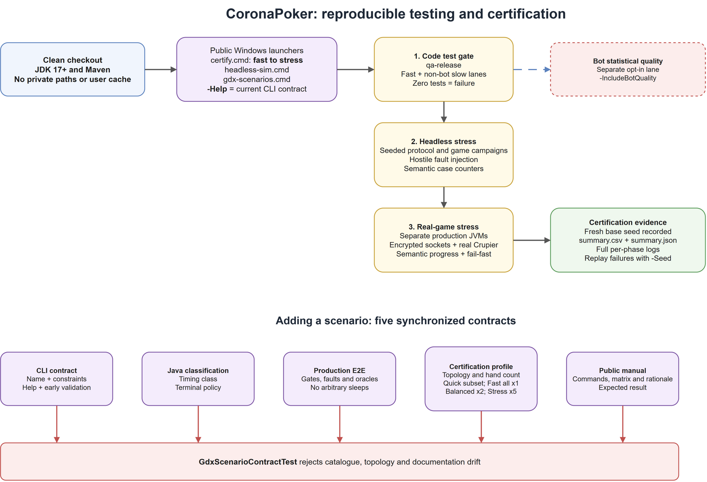

# Testing and certification

CoronaPoker separates code verification from game-behaviour certification.
This keeps everyday feedback fast and makes a certification result easy to
interpret.

## If you changed Java code: what to run

Use the repository-root console entry point. It prevents accidentally building
one module while omitting another test layer:

### Explicit prerequisites

- Windows with `powershell.exe` available (the checked-in `qa.cmd` wrapper uses
  Windows PowerShell with `-NoProfile` and an execution-policy bypass limited to
  that process).
- A JDK 17 or newer selected through the normal Maven `JAVA_HOME`/`PATH`
  mechanism. A JRE alone is insufficient.
- Apache Maven 3 or newer. The tool searches, in order: repository `mvnw.cmd`,
  `mvn.cmd`/`mvn` on `PATH`, then the standard Apache NetBeans Maven location.
  It prints the detected Maven and Java versions before doing work and refuses
  unsupported versions.
- Internet access on the first run, unless every required Maven dependency is
  already present in the ignored checkout-local `.m2/repository`. Later runs
  reuse that cache. The script does not depend on the user's global Maven
  repository.
- For scenarios, permission to start child Java processes and bind local
  loopback ports. They do not require an Internet opponent, router forwarding
  or a graphical desktop, but an over-restrictive firewall/security product can
  still block local process/socket tests.

Run commands from the repository root. No IDE, persisted game configuration,
MOD, database, language setting or manually installed test fixture is assumed.
Generated game homes, reports and build output stay in ignored directories.
The tool does not install Java or Maven. Maven still reads its standard
`settings.xml` for repository mirrors, proxies and credentials when your
network requires them. No private mirror, proxy, toolchain or IDE setting is
required by the repository itself. The checkout and its ignored `.m2` and
`target` directories must be writable and have enough free space for
dependencies, intermediate classes, reports and the self-contained JAR.

```powershell
# Quick rebuild plus runnable target/CoronaPoker_<version>.jar. Tests are skipped.
.\qa.cmd build

# Normal code check. Clean build plus product and architecture tests.
.\qa.cmd test

# Slow replayable non-bot regression lane. No GDX scenarios.
.\qa.cmd extended

# Gameplay-wiring check: run only the complete GDX catalogue once.
.\qa.cmd scenarios fast

# Complete release gate: product tests + extended QA + scenario catalogue.
.\qa.cmd all balanced

# Major protocol/recovery/concurrency gate: five scenario passes and deepest soak.
.\qa.cmd all stress
```

Running `.\qa.cmd` without arguments is identical to `test`. Use `build` only
when you deliberately want a quick compilation/package without validation.
Use `extended` only when the change justifies the slower replayable regression
lane. Scenarios never start implicitly. Choose `scenarios <mode>` when you only
need end-to-end gameplay evidence. Choose `all <mode>` to combine the product,
extended and GDX scenario lanes. Standalone headless campaigns remain explicit.

`fast`, `balanced` and `stress` do not select different scenario categories:
they run the same unified catalogue. Only repetitions and soak depth change.
When used through `all`, their product and test stages are identical. `quick`
is the only explicit critical subset and is intended for iteration, not
release evidence.

Useful focused forms:

```powershell
# Show every scenario and the exact JUnit method that implements it.
.\qa.cmd list

# Reproduce one scenario with a known seed.
.\qa.cmd scenarios fast -Scenario spectator-rebuy-cycle -Seed 42

# Add the separate statistical bot-strength lane to extended QA.
.\qa.cmd extended -IncludeBots

# Display every option without running anything.
.\qa.cmd -Help
```

The command uses the checkout-local `.m2/repository` and stops at the first
failed stage. `test` stops after the product reactor. `extended` and `all`
clean-build and install the current product before entering `tools/qa`, so the
extended tests cannot silently resolve another locally installed CoronaPoker
version. Successful build/test execution leaves the runnable JAR in `target/`.
Scenarios write evidence to `target/certification/`, and every non-list run
writes an overall machine-readable summary below `target/qa/`.



## The four layers

| Layer | Purpose | Typical cost | Main command |
|---|---|---|---|
| Product tests | Rules, networking, persistence, security, GDX contracts and architecture | A few minutes | `mvn clean verify` |
| Extended QA | Large opt-in regression suite under `tools/qa` | Minutes for the default lane. Longer for slow profiles | `mvn -f tools/reactor/pom.xml verify` |
| Headless campaigns | Seeded high-volume protocol and fault simulation | Proportional to the requested hands and faults | `.\tools\qa\headless-sim.cmd` |
| GDX certification | Complete gameplay scenarios, including real sockets and separate processes where required | From a targeted run to a long stress run | `.\tools\qa\certify.cmd -Mode balanced` |

The layers are complementary. A build failure is a code-test failure. A
certification failure is a gameplay-scenario failure. `certify.cmd` does not
silently run the other layers.

`qa.cmd` deliberately composes those existing layers. `test` runs only the
product gate, `extended` adds `qa-all`, `scenarios` runs only behavioural
certification, and `all` composes the three. It is the public
all-in-one console tool. The Maven commands and `certify.cmd` documented below
are lower-level entry points for focused diagnosis, CI or resuming a scenario
schedule. They are not additional or competing scenario catalogues.

Commands written below as bare `mvn` require Maven on `PATH`. When launched
from the repository root they inherit the tracked `.mvn/maven.config` and use
the same checkout-local cache, but they do not perform `qa.cmd`'s executable
discovery, version preflight, stage summary or argument validation. They are
diagnostic equivalents, not a hidden prerequisite for `qa.cmd`.

## Automatic and opt-in execution

| Execution | Starts when | Included work |
|---|---|---|
| Product build gate | Every `mvn verify`, `mvn package`, `mvn clean verify` or `mvn clean package` unless tests are explicitly skipped | Product unit tests, deterministic integration tests and architecture rules |
| Extended QA | Only when `tools/reactor/pom.xml` or `tools/qa/pom.xml` is invoked | The selected `qa-*` profile. The recommended reactor also runs the product gate against the same checkout |
| Headless campaign | Only when `headless-sim.cmd` is invoked | Configurable seeded protocol and fault simulations. By default it first runs the product gate |
| GDX certification | When `qa.cmd scenarios`, `qa.cmd all` or `certify.cmd` is invoked | Isolated behavioural scenarios selected by mode or name |

The dependency is one-way: a product build never enters `tools/qa`, but the
recommended QA reactor runs the product modules before its selected tool suite.
The product gate is intentionally substantial: it includes deterministic
in-process and real-loopback-socket integration tests because those checks are
stable enough to protect every build. The expensive statistical, high-volume,
multi-process and certification workloads remain opt-in. They never start in
the background and are not prerequisites for an ordinary local compile.

The commands are self-contained unless stated otherwise. The extended QA
reactor runs the product build and its tests before `tools/qa`. The headless
runner uses that reactor by default unless `-SkipGameBuild` is explicitly used.
That switch requires compatible product artifacts to be installed already.
The certifier performs a clean GDX test compilation with tests skipped and then
starts only each scheduled scenario test in an isolated Maven process.

## Recommended order

1. Run the smallest test that reproduces the change.
2. Run `mvn clean verify` before committing product or build changes.
3. Run the extended QA lane when shared game code, networking, persistence,
   security or test infrastructure changes.
4. Run the affected GDX scenario while diagnosing behavioural work.
5. Run `certify.cmd -Mode balanced` for a normal release or a significant
   gameplay change.
6. Reserve `stress` for broad protocol, recovery, concurrency or security work,
   or for establishing a new certification baseline.

Documentation-only and presentation-only changes do not require gameplay
certification unless they also change executable commands, input wiring or game
lifecycle behaviour.

## Product build and tests

From the repository root:

```powershell
mvn clean verify
```

This runs the tests in the product reactor:

- `coronapoker-core`: rules, protocol, networking, storage and shared logic
- `coronapoker-gdx`: frontend state, command/event wiring and GDX contracts
- `coronapoker-qa`: architecture and source-ownership rules.

The product build excludes tests tagged `certification`. Those scenarios are
run only through `certify.cmd`, where each mapped method receives an isolated
Maven process and the selected certification mode.

The runnable output is `target/CoronaPoker_<version>.jar`. Use
`-DskipTests` only to diagnose packaging. It is not a verified build.

A focused product test can be selected without failing the other modules for
having no matching class:

```powershell
mvn -f modules/pom.xml -pl coronapoker-gdx -am test `
  '-Dtest=GdxScenarioContractTest' `
  '-Dsurefire.failIfNoSpecifiedTests=false'
```

Select one test method by appending `#methodName`:

```powershell
mvn -f modules/pom.xml -pl coronapoker-gdx -am test `
  '-Dtest=GdxScenarioContractTest#everySwingScenarioHasItsOwnStrictGdxCoverage' `
  '-Dsurefire.failIfNoSpecifiedTests=false'
```

## Extended QA

`tools/qa` is an independent opt-in test module and is never reached by a root
product build or packaged in the game. The reactor wrapper builds it against
the current product sources, so no manual installation or version pin is
needed.

The Maven profiles are the executable grouping. They are intentionally based
on runtime characteristics rather than mirroring every source package:

| Selection | What it validates | Relative cost | When to use it |
|---|---|---:|---|
| default or `qa-fast` | Deterministic regressions not tagged `slow` | Low | Normal development and before a commit that changes shared code |
| `qa-heavy` | All slow non-bot regressions, including cryptographic differentials, socket stalls and protocol campaigns | High | After broad crypto, concurrency, network or protocol changes |
| `qa-crypto` | Slow tests in the cryptographic package | High | After changes to SRA, proofs, shuffle or field arithmetic |
| `qa-network` | The slow real-socket stall integration test | Medium | After socket framing, timeout or shutdown changes |
| `qa-protocol-sim` | Seeded protocol, lifecycle, Rabbit, recovery and SQL campaigns | Configurable | For high-volume deterministic protocol validation |
| `qa-headless-all` | Every automated non-visual integrity check except bot-strength statistics and the environment-specific ACL smoke | High | Broad regression before a release or after cross-cutting changes |
| `qa-all` | Fast and slow replayable QA except bot-strength statistics | High | Complete extended regression on a suitable developer or build host |
| `qa-bots` | Statistical matchups, hand-potential sampling and bot game-flow smoke | Very high | Only after bot decision or evaluator changes, and before a release that changes bots |

`qa-fast` is contained in `qa-all` and `qa-headless-all`. Running either broad
lane immediately after `qa-fast` repeats those fast checks. `qa-crypto` and
`qa-network` are focused subsets of the slow coverage in `qa-heavy` and
`qa-all`. `qa-bots` is deliberately independent and is never pulled in by an
aggregate profile. The protocol simulator can be invoked directly through the
profile, but `headless-sim.cmd` is preferred because it validates arguments,
records or generates a replay seed and builds the current checkout by default.
Focused profiles select only their named workload. Run the default fast lane
first unless `qa-all` or `qa-headless-all` will cover it in the same validation.

```powershell
# Fast deterministic QA. This is the default tools/qa selection.
mvn -f tools/reactor/pom.xml verify

# Fast and slow non-bot tests.
mvn -f tools/reactor/pom.xml verify -P qa-all

# Slow non-bot tests only.
mvn -f tools/reactor/pom.xml verify -P qa-heavy

# Statistical bot-strength tests only.
mvn -f tools/reactor/pom.xml verify -P qa-bots

# Slow cryptographic tests only.
mvn -f tools/reactor/pom.xml verify -P qa-crypto

# Slow real-socket integration tests only.
mvn -f tools/reactor/pom.xml verify -P qa-network

# Seeded protocol simulations using Maven properties directly.
mvn -f tools/reactor/pom.xml verify -P qa-protocol-sim

# Every non-visual integrity check except statistical bot quality.
mvn -f tools/reactor/pom.xml verify -P qa-headless-all
```

`qa-bots` remains separate because it measures playing strength statistically
and consumes substantially more CPU than integrity regressions. `qa-all`
intentionally excludes it. Neither profile is a gameplay certificate. Only
`certify.cmd` produces scenario-certification evidence.

To run one extended test:

```powershell
mvn -f tools/reactor/pom.xml verify `
  '-Dtest=PotMathTest' `
  '-Dsurefire.failIfNoSpecifiedTests=false'
```

The same selector syntax runs one method:

```powershell
mvn -f tools/reactor/pom.xml verify `
  '-Dtest=PotMathTest#singleWinnerGetsEverythingExact' `
  '-Dsurefire.failIfNoSpecifiedTests=false'
```

## Headless campaigns

The simulator stresses production protocol and domain components without
starting a complete GDX table lifecycle:

```powershell
.\tools\qa\headless-sim.cmd `
  -Hands 5000 -Faults 5000 -BotHands 100 -Seed 42
```

Use it for conservation, settlement, SRA, signed actions, Rabbit, Run It Twice,
exit/recovery models, SQLite replay and seeded fault injection. It is not a
substitute for socket/process scenarios.

`-AllNonVisual` runs all automated non-visual QA except statistical bot quality.
Run `headless-sim.cmd -Help` for the current options.

## GDX behavioural certification

The public certification entry point is:

```powershell
.\tools\qa\certify.cmd -Mode balanced
```

`GdxScenarioContract.CERTIFICATION_SCENARIOS` is the only executable scenario
catalogue. It contains every complete GDX gameplay scenario: independent JVMs
over real loopback sockets, native GDX controls, focused network flows, IWTSTH,
blind increases and post-Swing behaviour such as Rabbit Hunting. The certifier
reads that one map, resolves every named JUnit method and launches each one in a
fresh Maven process. There is one command, one schedule and one result.

`tools/qa/reference/swing-gold-scenarios.tsv` only preserves the final
37-scenario Swing baseline. Contract tests require every historical identifier
to remain in the unified catalogue and to retain at least one real
independent-process port. It is not a second executable lane, and the Swing code
is neither part of the product nor executed.

### Modes

| Mode | Catalogue | Repetitions | Normal soak | Use |
|---|---:|---:|---:|---|
| `quick` | Critical subset | 1 | 5 hands | Inner-loop behavioural check |
| `fast` | Complete (same catalogue) | 1 | 5 hands | Full breadth before broader validation |
| `balanced` | Complete (same catalogue) | 2 | 20 hands | Normal release certificate |
| `stress` | Complete (same catalogue) | 5 | 50 hands | Major or adversarial validation |

`fast`, `balanced` and `stress` never add or remove scenarios: only their number
of passes and soak depth change. Stress also deepens the heads-up, full mixed
and full-human normal topologies. Explicit `-ScenarioRepeats` and `-SoakHands`
values override the mode defaults.

Useful commands:

```powershell
# Show the exact executable catalogue.
.\tools\qa\certify.cmd -ListOnly

# Run every strict test mapped to one scenario.
.\tools\qa\certify.cmd -Scenario spectator-rebuy-cycle -Mode fast

# Replay with a known base seed.
.\tools\qa\certify.cmd -Mode stress -Seed 42

# Continue an interrupted schedule with the original mode and seed.
.\tools\qa\certify.cmd -Mode stress `
  -StartAtScenario reconnect-every-street -StartAtRepeat 3 -Seed 42
```

The certifier clean-compiles the GDX scenario reactor first. It then stops at
the first failed test and writes per-test logs plus `summary.csv` and
`summary.json` below `target/certification/<timestamp>-<mode>/`.

The printed scenario seed controls every game-path entropy domain used by the
GDX harness: hand and shuffle seeds, commit-reveal seating, bot personality and
decisions, automated straddle choices, recovery seating and observable
cinematic selection. Each domain is derived independently, so adding a draw in
one cannot shift the others. Cryptographic keys, proof randomness, transport
nonces and encryption IVs deliberately remain secure and may differ on replay.
They do not change the resulting cards or functional scenario path. A direct
JUnit replay may use `-Dcoronapoker.qa.scenarioSeed=<seed>`. The certifier sets
that property automatically from the seed recorded in its report.

A continuation report is not a standalone certificate. Keep it together with
the preceding partial report. If a fix changes shared protocol, scheduling or
harness semantics, restart the complete required mode instead of resuming.

## Adding scenarios

Add coverage at the lowest layer that can prove the invariant. A mocked
projection test cannot certify a reconnect, a crashed client or a process
boundary.

| Change | Primary test layer |
|---|---|
| Pure rule, codec, persistence or money calculation | Unit test in `coronapoker-core` |
| GDX command, projection, dialog state or lifecycle binding | Focused test in `coronapoker-gdx` |
| Complete game flow with production core objects | `GdxReconnectScenarioTest` |
| Real sockets, separate client processes, crashes or recovery | `GdxMultiprocessScenarioTest` |
| Large seeded protocol volume | `tools/qa/headless-sim.cmd` campaign |

Every complete gameplay scenario belongs to the same
`GdxScenarioContract.CERTIFICATION_SCENARIOS` map regardless of its origin or
implementation class. Do not create a second list in Java, PowerShell or
documentation.

### Scenario architecture

The scenario system has four contracts:

1. `tools/qa/reference/swing-gold-scenarios.tsv` preserves the immutable list
   of 37 historical gameplay scenarios used as the migration baseline. It is a
   reference manifest, not an executable lane.
2. `GdxScenarioContract.java` owns the single executable map
   `CERTIFICATION_SCENARIOS`. Historical ports and new scenarios live together
   in this map. Its contract test rejects missing, duplicated, in-process or
   invented historical coverage.
3. `GdxMultiprocessScenarioTest.java` launches host and client JVMs used by
   release certification. `GdxMultiprocessNodeMain.java` is the node process.
4. `tools/qa/run-certification.ps1` reads the Java map and defines execution
   policy only. It controls mode depth, repetitions, seeds, isolation and
   reports.

New coverage that has no Swing predecessor still goes into the same Java map.
Change the historical TSV only when correcting the recorded baseline and
explain that correction in the commit.

Important files:

| File | Responsibility |
|---|---|
| `modules/coronapoker-gdx/src/test/java/com/tonikelope/coronapoker/gdx/scenarios/GdxScenarioContract.java` | Single executable scenario catalogue plus the immutable Swing reference set |
| `modules/coronapoker-gdx/src/test/java/com/tonikelope/coronapoker/gdx/scenarios/GdxScenarioContractTest.java` | Mapping and coverage invariants |
| `modules/coronapoker-gdx/src/test/java/com/tonikelope/coronapoker/gdx/scenarios/GdxReconnectScenarioTest.java` | Production-core game scenarios observed through GDX |
| `modules/coronapoker-gdx/src/test/java/com/tonikelope/coronapoker/gdx/GdxMultiprocessScenarioTest.java` | Parent process, topology, process faults and final assertions |
| `modules/coronapoker-gdx/src/test/java/com/tonikelope/coronapoker/gdx/GdxMultiprocessNodeMain.java` | Host or client process behaviour and semantic markers |
| `modules/coronapoker-gdx/src/test/java/com/tonikelope/coronapoker/gdx/scenarios/GdxScenarioRenderer.java` | Test renderer, native action readiness and observations |
| `tools/qa/run-certification.ps1` | Mode depth, process isolation, seed schedule and reports |

### 1. Define the behaviour

Write the precondition, trigger and observable result before editing the
harness. A useful contract answers these questions:

- Which peer owns the action?
- At which hand and street may it occur?
- What event proves the peer is ready?
- Which socket or process fault is applied?
- Which peer must remain alive?
- What ledger, stack, hand counter or consensus value must match at the end?
- What output proves that the intended branch executed?

Elapsed time is not proof that the game reached a state.

### 2. Add the smallest failing regression

Add a focused unit or GDX integration test first. Every complete gameplay
scenario also goes into `CERTIFICATION_SCENARIOS`. A historical scenario keeps
at least one independent-JVM port. Product-table or focused network tests may
sit beside that port under the same scenario key. A critical method may remain
untagged so the ordinary build also runs it, but this does not create a second
catalogue. A certification method may belong to one scenario only.

Run the mapping guard while developing the scenario:

```powershell
mvn -f modules/pom.xml -pl coronapoker-gdx -am test `
  '-Dtest=GdxScenarioContractTest' `
  '-Dsurefire.failIfNoSpecifiedTests=false'
```

### 3. Synchronize on meaning

Coordinate parent and node processes with explicit state or semantic markers.
Useful gates include:

- a specific hand and street
- an active local turn
- a native button becoming enabled
- a reconnect count changing
- a recovery lobby opening
- a player becoming spectator or active
- a committed action appearing in the durable ledger

Never replace a semantic gate with a fixed sleep. A short polling interval is
acceptable inside a bounded wait, but its predicate must represent game
progress. Every wait needs a timeout and diagnostics that name the missing
state.

When an action is submitted through GDX, first assert the same readiness used
by the real control. Calling a helper immediately after socket reconnection can
otherwise create a harness race that a user could never trigger.

Functional label checks must use the production `GdxFunctionalLabelOracle` or
the equivalent semantic observation exposed by the harness. Assert canonical
meaning for action, pot, blind and result labels. Do not assert one translated
display string or force the user's configured language. The oracle must accept
every supported translation while still rejecting the wrong poker meaning.

### 4. Add multiprocess coverage

Add one method to `GdxMultiprocessScenarioTest` when the behaviour crosses a
process boundary. Reuse the existing host and client launchers plus isolated
homes. Assert the intended transition, not only process exit code zero.

The final oracle normally checks that:

- every expected process reached its completion marker
- no fatal or unexpected dialog marker was emitted
- canonical ledgers match across surviving peers
- stacks and buy-ins conserve money
- the expected number of durable hands was committed
- required recovery, reconnect, Run It Twice, straddle or spectator markers occurred
- no stale process remains after teardown

Scale timeouts by the work being performed. Large tables need a
participant-aware budget, not only a hand-count budget. Do not increase a
timeout until the log shows semantic progress throughout the extra interval.

### 5. Register once

Register the method under one scenario key in
`GdxScenarioContract.CERTIFICATION_SCENARIOS`. If it ports a historical Swing
scenario, keep at least one method for that key in
`GdxMultiprocessScenarioTest`. Native or focused coverage may be additional
methods under the same key, but it cannot replace the process-isolated port.
Add the scenario name to the certifier's `quickScenarios` only when it belongs
in the short iteration subset.

Do not add a second method list to PowerShell. The certifier discovers the Java
map and derives every execution seed from the printed base seed.

### 6. Validate in increasing scope

Run the focused test first:

```powershell
mvn -f modules/pom.xml -pl coronapoker-gdx -am test `
  '-Dtest=GdxMultiprocessScenarioTest#yourMethodName' `
  '-Dsurefire.failIfNoSpecifiedTests=false' `
  '-Dqa.sim.seed=42'
```

Run the complete behavioural catalogue once:

```powershell
.\qa.cmd scenarios fast
```

For race, watchdog, scheduling or recovery changes, finish with a fresh-seed
stress pass:

```powershell
.\qa.cmd scenarios stress
```

On failure, rerun the exact printed seed before using a new seed. Fix the
product or harness according to the first violated contract. Never weaken an
oracle merely to make a failing product pass.

All factories used by a GDX scenario obtain `GameEntropySource` and session IDs
from the seeded scenario helper. Never call `CryptoRandom`,
`ThreadLocalRandom`, `Math.random` or an unseeded `Random` for a choice that can
change cards, seats, bot actions, labels, animation selection or lifecycle.
Keep security-only entropy for keys, proofs, IVs and transport challenges
secure. Replayability applies to the functional path, not to cryptographic
byte-for-byte identity. The contract suite rejects dealer game-path randomness
that bypasses the injected source.

### Completion checklist

- [ ] The invariant and expected failure mode are explicit.
- [ ] The lowest useful regression is red before the fix and green after it.
- [ ] Historical mappings remain one-to-one and complete.
- [ ] Multiprocess scenarios use separate JVMs and isolated homes.
- [ ] Synchronization is semantic and every wait is bounded.
- [ ] Native GDX readiness is checked before submitting an action.
- [ ] Functional labels are checked by canonical meaning in every supported language.
- [ ] Final ledgers, stacks, buy-ins and durable hand counts are asserted.
- [ ] The scenario is registered once in the Java map.
- [ ] The exact failing seed passes after the fix.
- [ ] The required `fast`, `balanced` or `stress` gate finishes with a PASS banner.

Visual alignment, animation quality, physical audio hardware and real Internet
or NAT behaviour remain manual checks. They complement the automated
certificate and do not replace it.

## Choosing the right gate

| Change | Required validation |
|---|---|
| Local calculation or parser | Focused regression, then `mvn clean verify` |
| GDX layout or cosmetic presentation | Focused contract/layout tests and product build. Manual visual review remains required |
| Shared game rules or table lifecycle | Product build, extended QA, affected scenario, then `balanced` when release-bound |
| Sockets, reconnect, crash or recovery | Product build, extended QA, affected multiprocess scenario, then `fast` or `balanced` |
| Crypto or signed protocol | Product build, `qa-crypto`, headless campaign and affected scenarios. Use `stress` for broad changes |
| Bot decision quality | Product build and `qa-bots`. Scenario certification is needed only if game flow changed |
| Test harness only | Harness contracts and affected scenarios. Broaden only if common semantics changed |
| Normal release | Product build, appropriate extended QA and `balanced` certification |
| Major release baseline | `fast`, then fresh-seed `stress` after all narrower lanes pass |

Always distinguish a product defect from a harness defect. The first violated
contract, process log and seed replay should identify which side is wrong. Do
not weaken an oracle merely to make a scenario green.

## What automation proves

The automated layers verify rules, money conservation, protocol agreement,
persistence, recovery, command/event wiring, socket/process lifecycle and the
historical scenario catalogue.

They do not certify subjective rendering quality, exact pixels, physical audio
devices, real Internet/NAT behaviour or every operating-system display setup.
Those checks remain manual and complement the automated certificate.

## How to read a manual run

`qa.cmd` prints a cyan heading for each layer and ends every completed layer in
`PASS` or `FAIL`. Its process exit code is `0` only when every requested layer
passes. It stops immediately on the first failure, so later layers shown in the
documentation but absent from the console were not executed.

### Maven product and extended-test output

The authoritative final lines are:

```text
Tests run: <n>, Failures: 0, Errors: 0, Skipped: <n>
BUILD SUCCESS
```

`BUILD FAILURE`, a non-zero `Failures` or `Errors` value, or an `[ERROR]` block
is a real failure. The first failing test name and its surefire report are the
starting point. Reports live under the corresponding module's
`target/surefire-reports/` directory.

Game integration tests intentionally emit extensive dealer, bot, networking
and zero-trust `INFO` logs. Some negative tests also provoke and assert rejected
input, corrupt preferences, malformed XML or cooperative thread interruption,
so an isolated `WARNING` or `SEVERE` line is not by itself a failed test. On
recent JDKs, SQLite can also print a native-access warning. Judge these lines in
context: Maven's test counts, final build result and exit code are authoritative.

### GDX scenario output

The certifier first prints its `Mode`, generated or supplied `BaseSeed`, number
of scenarios/tests, repetitions and soak hands. Each isolated test then appears
as:

```text
[12/<scheduled>] r1 scenario-name -> package.TestClass#method
  PASS (12.345 s)
```

Success ends in `CORONAPOKER GDX CERTIFICATION PASS`. On failure the runner
prints `FAIL`, shows the last part of that test's log, writes `summary.csv` and
`summary.json`, and stops. Preserve the printed seed: rerun the failing scenario
with `-Scenario <name> -Seed <BaseSeed>`. The per-row `Seed` in the CSV is the
derived seed passed to that isolated test. The report records both values.

The functional label oracles compare canonical meaning rather than the current
configured language. They validate action, pot, blind and result information
without requiring a particular translation. Pixel quality, font appearance,
audio hardware, real Internet/NAT and operating-system rendering remain manual
checks even when the scenario certificate is green.

### Central summary

At the end, `qa.cmd` writes
`target/qa/<timestamp>-<command>[-<mode>]/summary.txt` and `summary.json`.
These identify the first failed layer and its exit code. The scenario directory
remains the detailed evidence for gameplay failures. The central summary does
not replace its logs.

## Generated state

- `.m2/repository` is the ignored checkout-local Maven cache. Deleting it does
  not affect source code, but Maven must reconstruct it.
- Module `target` directories contain intermediate build output.
- Repository-root `target` contains the runnable JAR and ignored QA reports.
- Test homes are generated below build output and must never be committed.

Use `mvn clean` for product build cleanup. Because extended QA is deliberately
outside the product reactor, use `mvn -f tools/reactor/pom.xml clean` when its
generated `tools/qa/target` state should also be removed. Do not delete caches
or reports while another Maven, certification or game process is using them.
